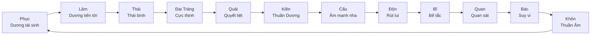

# Âm Dương & Tiêu Trưởng

## Nguyên lý Âm Dương

Âm Dương không phải 2 thực thể đối lập tuyệt đối. Chúng là 2 mặt của cùng một thực tại (Thái Cực), luôn chứa mầm của nhau.

### 5 Quy luật cơ bản

**1. Âm Dương tương đối, không tuyệt đối**
- Không có gì thuần Âm hay thuần Dương
- "Âm trung hữu Dương căn, Dương trung hữu Âm căn" (trong Âm có gốc Dương, trong Dương có gốc Âm)
- Ví dụ: Thành công (Dương) chứa mầm tự mãn (Âm). Thất bại (Âm) chứa mầm bài học (Dương)

**2. Âm Dương hỗ căn (nương tựa nhau)**
- "Cô Âm tắc bất sinh, Cô Dương tắc bất trưởng" (Âm đơn độc không sinh, Dương đơn độc không trưởng)
- Mọi hệ thống bền vững đều cần CẢ HAI: cứng rắn và mềm mỏng, mở rộng và thu gọn, hành động và suy tư

**3. Âm Dương tiêu trưởng (lên xuống luân phiên)**
- Khi một bên tăng (trưởng), bên kia giảm (tiêu)
- "Nhất Âm nhất Dương chi vị Đạo" (một Âm một Dương gọi là Đạo)
- Không bao giờ dừng ở trạng thái cố định

**4. Âm Dương chuyển hóa (cực thì biến)**
- "Vật cùng tắc biến" (đến cùng cực ắt biến đổi)
- Âm cực thì Dương sinh. Dương cực thì Âm sinh
- Ví dụ: Thị trường bùng nổ (Dương cực) tất yếu điều chỉnh (Âm sinh)

**5. Âm Dương quân bình (cân bằng động)**
- Cân bằng tuyệt đối = điểm chết. Cần sự so le nhẹ để duy trì chuyển động
- "Tham Thiên Lưỡng Địa" (3 phần Trời, 2 phần Đất): Dương thừa nhẹ so với Âm để có động lực tiến hóa

## Tứ Tượng (4 trạng thái)

Từ Âm Dương sinh ra 4 trạng thái, mô tả chu kỳ hoàn chỉnh:

```
Thái Dương → Thiếu Âm → Thái Âm → Thiếu Dương → (lặp lại)
 (cực thịnh)   (bắt đầu suy)  (cực suy)   (bắt đầu hồi phục)
```

| Tứ Tượng | Ý nghĩa | Mùa | Trạng thái | Ẩn chứa |
|----------|---------|-----|-----------|---------|
| **Thái Dương** | Dương cực thịnh | Hạ | Đỉnh cao, rực rỡ | Mầm suy giảm bắt đầu |
| **Thiếu Âm** | Âm bắt đầu tăng | Thu | Thu hoạch, chín muồi | Năng lượng đang chuyển hướng |
| **Thái Âm** | Âm cực thịnh | Đông | Đáy, tĩnh lặng, tàng | Mầm phục hồi đang ủ |
| **Thiếu Dương** | Dương bắt đầu tăng | Xuân | Nảy mầm, khởi động | Tiềm năng chưa bộc lộ |

**Ứng dụng phân tích:** Xác định tình huống đang ở Tứ Tượng nào giúp dự đoán pha tiếp theo. Thái Dương → chuẩn bị cho suy giảm. Thái Âm → kiên nhẫn chờ phục hồi.

## Phúc-Họa (phân tích cơ hội trong nguy cơ)

> "Họa trung hữu Phúc, Phúc trung hữu Họa"

Nguyên tắc phân tích:

| Tình huống | Câu hỏi phân tích | Ví dụ |
|-----------|-------------------|-------|
| Đang thuận lợi (Phúc) | Rủi ro tiềm ẩn là gì? Đang tự mãn ở đâu? | Startup tăng trưởng nhanh → nhân sự quá tải, văn hóa pha loãng |
| Đang khó khăn (Họa) | Cơ hội ẩn chứa là gì? Bài học nào đang được rèn? | Mất khách hàng lớn → buộc đa dạng hóa, giảm phụ thuộc |
| Đang ổn định | Lực nào đang ngầm tăng? Dấu hiệu thay đổi? | Thị trường yên ắng → đối thủ đang tích lũy, công nghệ mới đang manh nha |

## 12 Quẻ Tiêu Tức (Vòng Tuần Hoàn)

12 quẻ chủ tể mô tả chu kỳ hoàn chỉnh thịnh-suy qua 12 tháng:



**Cách dùng:** Xác định tình huống đang ở quẻ nào trong vòng tuần hoàn → biết pha tiếp theo + chiến lược phù hợp.

## Áp dụng Âm Dương vào phân tích tình huống

### Bước 1: Nhận diện cặp Âm Dương

| Lĩnh vực | Dương | Âm |
|----------|-------|-----|
| Hành động | Tiến, mở rộng, tấn công | Thoái, thu gọn, phòng thủ |
| Phong cách | Cương (cứng rắn, quyết đoán) | Nhu (mềm mỏng, linh hoạt) |
| Thông tin | Minh (rõ ràng, công khai) | Ám (ẩn khuất, nội bộ) |
| Năng lượng | Ngoại (hướng ngoại, biểu hiện) | Nội (hướng nội, tích lũy) |
| Thời gian | Ngắn hạn, tức thì | Dài hạn, tích lũy |
| Tổ chức | Tăng trưởng, đổi mới | Ổn định, bảo toàn |

### Bước 2: Đánh giá Tiêu Trưởng

- Lực nào đang tăng (trưởng)? Bằng chứng?
- Lực nào đang giảm (tiêu)? Dấu hiệu?
- Tốc độ thay đổi nhanh hay chậm?
- Đã gần cực điểm chưa?

### Bước 3: Dự đoán xu hướng

- Nếu Dương đang trưởng mạnh → chuẩn bị cho giai đoạn Âm
- Nếu Âm đang cực thịnh → tìm mầm Dương đang ủ
- Nếu đang ở giao điểm → thời khắc quyết định, hành động có trọng lượng lớn
