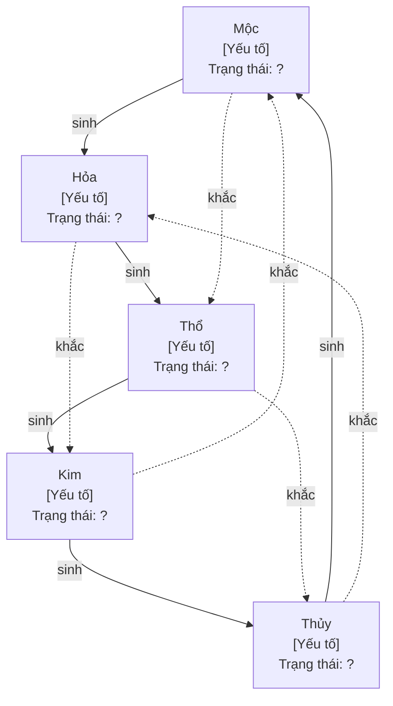

# Ngũ Hành: Cân Bằng Hệ Thống

## 5 Hành và tính chất

| Hành | Tính chất | Mùa | Hướng | Từ khóa |
|------|-----------|-----|-------|---------|
| **Mộc** | Sinh trưởng, vươn lên, mở rộng | Xuân | Đông | Sáng tạo, khởi phát, tầm nhìn |
| **Hỏa** | Rực rỡ, lan tỏa, nhiệt huyết | Hạ | Nam | Truyền cảm hứng, kết nối, biểu hiện |
| **Thổ** | Ổn định, nuôi dưỡng, trung tâm | Giao mùa | Trung | Nền tảng, quy trình, tin cậy |
| **Kim** | Thu gom, kỷ luật, sắc bén | Thu | Tây | Tinh lọc, chuẩn mực, cắt giảm |
| **Thủy** | Lưu chuyển, thâm sâu, thích ứng | Đông | Bắc | Trí tuệ, linh hoạt, tiềm năng |

## Tương Sinh (nuôi dưỡng)

Mỗi hành sinh ra hành tiếp theo trong vòng tròn:

```
Mộc → Hỏa → Thổ → Kim → Thủy → Mộc
```

| Quan hệ | Ý nghĩa | Ví dụ tổ chức |
|---------|---------|---------------|
| Mộc sinh Hỏa | Tầm nhìn nuôi dưỡng nhiệt huyết | Chiến lược rõ ràng → đội ngũ hào hứng |
| Hỏa sinh Thổ | Nhiệt huyết tạo nền tảng | Văn hóa mạnh → quy trình được tôn trọng |
| Thổ sinh Kim | Nền tảng vững → tinh lọc | Quy trình ổn định → chuẩn mực chất lượng |
| Kim sinh Thủy | Kỷ luật tạo trí tuệ | Chuẩn mực → tích lũy tri thức, kinh nghiệm |
| Thủy sinh Mộc | Trí tuệ nuôi sáng tạo | Tri thức sâu → ý tưởng mới, đổi mới |

## Tương Khắc (kiềm chế)

Mỗi hành kiềm chế hành cách 1 trong vòng tròn:

```
Mộc khắc Thổ → Thổ khắc Thủy → Thủy khắc Hỏa → Hỏa khắc Kim → Kim khắc Mộc
```

| Quan hệ | Ý nghĩa | Ví dụ tổ chức |
|---------|---------|---------------|
| Mộc khắc Thổ | Đổi mới phá vỡ ổn định | Sáng tạo quá nhiều → quy trình bị bỏ qua |
| Thổ khắc Thủy | Quy trình cứng nhắc kìm linh hoạt | Bộ máy quan liêu → mất tính thích ứng |
| Thủy khắc Hỏa | Phân tích quá mức dập tắt nhiệt huyết | Overthinking → mất động lực hành động |
| Hỏa khắc Kim | Nhiệt huyết bỏ qua kỷ luật | Hào hứng quá → bỏ qua chuẩn mực |
| Kim khắc Mộc | Kỷ luật cứng ngăn sáng tạo | Quy định quá chặt → không ai dám đổi mới |

**Tương khắc không xấu.** Nó giữ cân bằng, ngăn hành nào phát triển quá mức. Vấn đề chỉ xảy ra khi khắc quá mạnh (chèn ép) hoặc quá yếu (mất kiểm soát).

## Bảng ánh xạ Ngũ Hành

### Tổ chức / Doanh nghiệp

| Hành | Yếu tố | Biểu hiện khỏe | Biểu hiện mất cân bằng |
|------|--------|----------------|----------------------|
| Mộc | Chiến lược, đổi mới | Tầm nhìn rõ, liên tục cải tiến | Thay đổi liên tục, không ổn định |
| Hỏa | Văn hóa, truyền thông | Đội ngũ gắn kết, nhiệt huyết | Cháy sáng rồi kiệt sức, drama nội bộ |
| Thổ | Vận hành, quy trình | Ổn định, đáng tin, hiệu quả | Quan liêu, chậm chạp, kháng cự thay đổi |
| Kim | Tài chính, chuẩn mực | Kỷ luật chi tiêu, chất lượng cao | Cắt giảm quá mức, thiếu đầu tư |
| Thủy | Nhân sự, tri thức | Nhân tài linh hoạt, học hỏi | Thiếu nhân lực, mất tri thức tổ chức |

### Cá nhân / Lãnh đạo

| Hành | Yếu tố | Biểu hiện khỏe | Biểu hiện mất cân bằng |
|------|--------|----------------|----------------------|
| Mộc | Tầm nhìn, mục tiêu | Có hướng đi rõ ràng | Mơ mộng không thực tế, hoặc mất phương hướng |
| Hỏa | Nhiệt huyết, quan hệ | Đam mê, kết nối tốt | Nóng nảy, hoặc lạnh lùng xa cách |
| Thổ | Sức khỏe, thói quen | Ổn định, kỷ luật thân | Ì ạch, hoặc bất ổn không nền tảng |
| Kim | Nguyên tắc, quyết đoán | Rõ ràng đúng sai, cắt bỏ thừa | Cứng nhắc quá, hoặc thiếu nguyên tắc |
| Thủy | Trí tuệ, thích ứng | Linh hoạt, học nhanh | Lo lắng quá, hoặc bất cần |

### Dự án / Sản phẩm

| Hành | Yếu tố | Biểu hiện khỏe | Biểu hiện mất cân bằng |
|------|--------|----------------|----------------------|
| Mộc | Tính năng, roadmap | Phát triển có hướng | Feature creep, hoặc stagnation |
| Hỏa | Marketing, UX | Người dùng hào hứng | Hype rỗng, hoặc sản phẩm tốt nhưng không ai biết |
| Thổ | Infra, vận hành | Stable, scalable | Nợ kỹ thuật chồng chất, hoặc over-engineering |
| Kim | QA, bảo mật | Chất lượng đảm bảo | Test quá nhiều chậm delivery, hoặc ship lỗi |
| Thủy | Data, R&D | Học từ dữ liệu, thử nghiệm | Analysis paralysis, hoặc không đo lường |

## Chẩn đoán và điều chỉnh

### Nguyên tắc bổ-tả

| Tình trạng | Nguyên tắc | Cách làm |
|-----------|-----------|----------|
| Hành A yếu | "Mẫu hư bổ kỳ Tử" (bổ mẹ để nuôi con) | Tăng cường hành sinh ra A |
| Hành A quá mạnh | "Mẫu thực tả kỳ Tử" (giảm mẹ để bớt con) | Giảm hành sinh ra A, hoặc tăng hành khắc A |
| 2 hành xung đột | Tăng hành trung gian | Thêm yếu tố đệm giữa 2 hành |

### Quy trình chẩn đoán

1. Ánh xạ 5 yếu tố cốt lõi vào Ngũ Hành (dùng bảng trên)
2. Đánh giá mỗi hành: mạnh, vừa, yếu
3. Kiểm tra chuỗi tương sinh: có chỗ nào đứt gãy?
4. Kiểm tra tương khắc: có chỗ nào quá mạnh (chèn ép)?
5. Xác định hành gốc cần điều chỉnh (thường là hành "mẹ" của hành yếu nhất)
6. Đề xuất can thiệp cụ thể

### Sơ đồ Ngũ Hành (template Mermaid)



Thay `[Yếu tố]` và `Trạng thái` bằng nội dung cụ thể của tình huống. Dùng style để highlight hành mất cân bằng.
