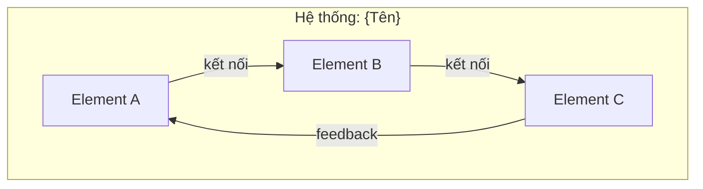
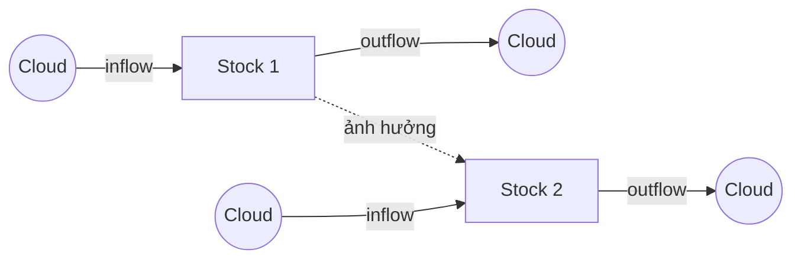
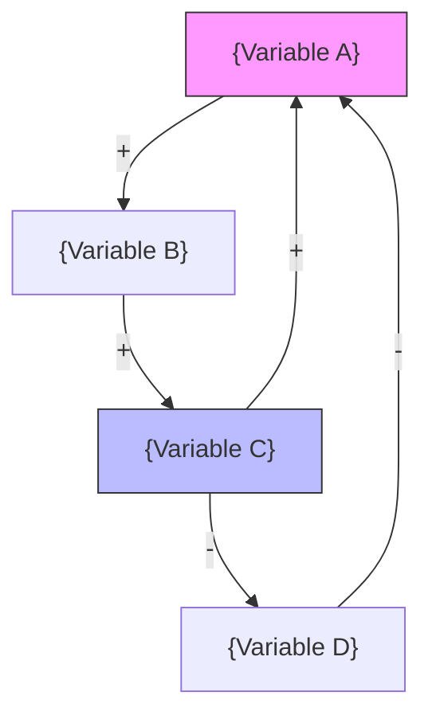

# Phân tích hệ thống: {TÊN CHỦ ĐỀ}

> Phân tích theo framework Thinking in Systems (Donella Meadows)

---

## 0. Bối cảnh & Research

> Section này chỉ xuất hiện khi đã thực hiện research ở Bước 0. Bỏ qua nếu không cần.

**Nguồn tham khảo:**
- {Nguồn 1 — data/thống kê quan trọng}
- {Nguồn 2}

**Phát hiện chính từ research:**
- {Insight quan trọng ảnh hưởng đến phân tích}

---

## 1. Nhịp đập của hệ thống

**Bối cảnh:** {Mô tả ngắn gọn hệ thống đang phân tích}

**Hành vi quan sát được:**

- {Pattern 1: xu hướng, dao động, hoặc trạng thái ổn định}
- {Pattern 2}
- {Pattern 3}

**Câu chuyện phổ biến vs. Thực tế:**

- Người ta nói: "{narrative phổ biến}"
- Thực tế: "{data/pattern thực}"

---

## 2. Bản đồ hệ thống

**Elements (Phần tử):**

- Hữu hình: {liệt kê}
- Vô hình: {liệt kê — niềm tin, văn hóa, kỳ vọng, danh tiếng}

**Interconnections (Kết nối):**

- {Luồng vật chất/tiền/nguồn lực}
- {Luồng thông tin/tín hiệu}
- {Quy tắc/norms chi phối hành vi}

**Purpose (Mục đích thực):**

- Mục đích tuyên bố: {stated purpose}
- Mục đích thực (quan sát từ hành vi): {actual purpose}

---

## 3. Stocks & Flows

| Stock     | Inflow (dòng vào) | Outflow (dòng ra) | Trạng thái          |
| --------- | ----------------- | ----------------- | ------------------- |
| {Stock 1} | {inflow}          | {outflow}         | {tăng/giảm/ổn định} |
| {Stock 2} | {inflow}          | {outflow}         | {tăng/giảm/ổn định} |

**Insight về stocks:**

- {Stocks nào đang tích lũy nguy hiểm?}
- {Stocks nào đang cạn kiệt?}
- {Delays nào đáng chú ý?}

---

## 4. Feedback Loops

### Reinforcing Loops (R)

- **R1: {Tên loop}** — {Mô tả vòng khuếch đại: A↑ → B↑ → C↑ → A↑}

### Balancing Loops (B)

- **B1: {Tên loop}** — {Mô tả vòng cân bằng: A↑ → B↑ → C↓ → A↓}

### Loop Dominance

- Hiện tại **{R/B nào}** đang chi phối → hệ thống đang {tăng trưởng/ổn định/suy thoái}
- Khi {điều kiện}, dominance có thể chuyển sang **{loop khác}**

---

## 5. System Traps phát hiện

### Trap: {Tên trap}

**Cơ chế trong tình huống này:**
{Mô tả cụ thể trap đang hoạt động như thế nào}

**Bằng chứng:**

- {Evidence 1}
- {Evidence 2}

**Way out:**

- {Giải pháp cụ thể cho tình huống này}

---

## 6. Leverage Points

### Hiện tại đang can thiệp ở đâu?

- **LP #{số}** ({tên}): {mô tả can thiệp hiện tại} → **Hiệu quả: {thấp/trung bình}**

### Can thiệp hiệu quả hơn ở đâu?

- **LP #{số}** ({tên}): {đề xuất can thiệp mới} → **Tiềm năng: {cao/rất cao}**
- **LP #{số}** ({tên}): {đề xuất can thiệp mới} → **Tiềm năng: {cao/rất cao}**

### Cảnh báo counterintuitive

{Điều gì có vẻ đúng nhưng thực ra sẽ làm tệ hơn? Điều gì có vẻ sai nhưng thực ra hiệu quả?}

---

## 7. Đề xuất hành động

### Ngắn hạn (Quick wins)

1. {Hành động cụ thể — dựa trên information flows hoặc feedback}

### Trung hạn (Structural changes)

1. {Thay đổi rules, incentives, hoặc structure}

### Dài hạn (Paradigm shifts)

1. {Thay đổi goals, mental models, hoặc paradigm}

### Nguyên tắc wisdom áp dụng

- {Nguyên tắc 1 từ systems wisdom và cách áp dụng cụ thể}
- {Nguyên tắc 2}

---

## Câu hỏi mở

Những câu hỏi mà phân tích này chưa trả lời được — mời bạn tiếp tục suy nghĩ:

1. {Câu hỏi sâu 1 — thách thức một giả định trong phân tích}
2. {Câu hỏi sâu 2 — mở rộng ranh giới suy nghĩ}
3. {Câu hỏi sâu 3 — kết nối với hệ thống lớn hơn}
