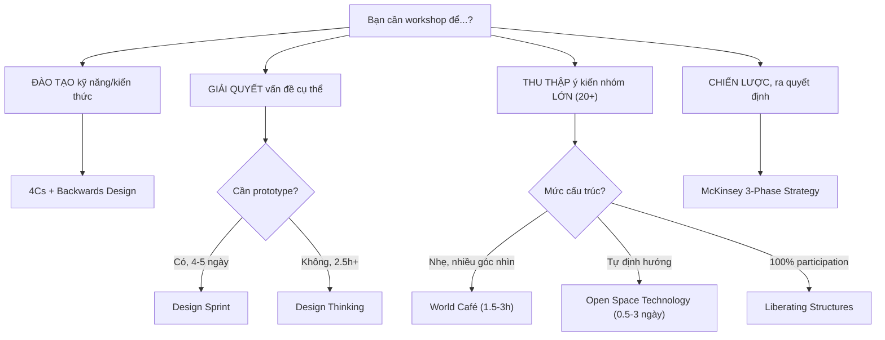

# Chọn Framework Phù Hợp

Không có framework nào "tốt nhất cho mọi tình huống." Dùng ma trận dưới đây để chọn.

## Ma Trận Chọn Framework

| Framework | Quy mô | Thời lượng | Mức cấu trúc | Phù hợp nhất cho |
|---|---|---|---|---|
| **4Cs + Backwards Design** | 5-40 | 2h - 1 ngày | Cao | Đào tạo kỹ năng, kiến thức |
| **Design Sprint** | 4-7 | 4-5 ngày | Rất cao | Giải quyết vấn đề sản phẩm, prototype |
| **Design Thinking (d.school)** | 4-20 | 2.5h - nhiều ngày | Trung bình | Đổi mới sáng tạo, empathy-driven |
| **Liberating Structures** | 2-1000+ | 12 phút - nhiều giờ | Thấp-TB | Mọi cuộc họp/workshop, 100% participation |
| **World Café** | 20-200 | 1.5-3 giờ | Thấp | Thu thập ý kiến đa chiều, brainstorm lớn |
| **Open Space Technology** | 20-2000+ | 0.5-3 ngày | Rất thấp | Khám phá vấn đề phức tạp, tự tổ chức |
| **McKinsey Strategy** | 8-30 | 6-16 giờ | Cao | Hoạch định chiến lược, ra quyết định |

## Cây Quyết Định Nhanh



## Kết Hợp Framework — Chiến Lược Tối Ưu

| Giai đoạn | Framework kết hợp | Mục đích |
|---|---|---|
| Warm-up | Liberating Structures (1-2-4-All, TRIZ) | Phá băng, đảm bảo mọi người tham gia |
| Khám phá vấn đề | Design Thinking (Empathize + Define) | Hiểu sâu người dùng/bối cảnh |
| Nội dung chính | 4Cs (Connections → Conclusions) | Cấu trúc module đào tạo |
| Brainstorm lớn | World Café (3 rounds) | Cross-pollinate ý tưởng |
| Kết thúc | McKinsey Follow-up | Action items + accountability |

---

## Các Format Workshop Chuyên Biệt

### Format 1: World Café — Thu thập ý kiến nhóm lớn (20-200 người)

**Thời lượng:** 1.5-3 giờ
**Setup:** Bàn tròn nhỏ (4 người/bàn), khăn trải bàn giấy trắng/flipchart, bút marker màu

```
Quy trình:
1. WELCOME & CONTEXT (10 phút)
   Giải thích quy trình, giới thiệu câu hỏi

2. ROUND 1 (20 phút)
   Nhóm 4 người thảo luận câu hỏi 1
   Ghi ý tưởng lên giấy trải bàn

3. DI CHUYỂN — giữ lại 1 "Table Host"
   3 người còn lại tỏa ra các bàn khác
   Table Host tóm tắt cho nhóm mới

4. ROUND 2 (20 phút) — câu hỏi 2
   Xây dựng trên insights từ Round 1

5. DI CHUYỂN (lặp lại)

6. ROUND 3 (20 phút) — câu hỏi 3
   Tổng hợp, đề xuất hành động

7. HARVESTING (20-30 phút)
   Toàn phòng chia sẻ patterns + insights
```

**Mẹo thiết kế câu hỏi:**
- Round 1: Khám phá — "Điều gì quan trọng nhất về X đối với chúng ta?"
- Round 2: Đào sâu — "Làm sao chúng ta có thể tiếp cận X khác đi?"
- Round 3: Hành động — "Bước tiếp theo cụ thể nhất là gì?"

### Format 2: Mini Design Sprint (1-2 ngày)

**Khi nào dùng:** Cần giải quyết 1 vấn đề sản phẩm/dịch vụ cụ thể + tạo prototype
**Quy mô:** 4-7 người (facilitator + designer + decision maker + 2-4 chuyên gia)

```
NGÀY 1 — HIỂU & Ý TƯỞNG (7 giờ)
Sáng:
  09:00  Mục tiêu dài hạn + Câu hỏi Sprint
  09:30  Vẽ bản đồ vấn đề (Map)
  10:30  Phỏng vấn chuyên gia nội bộ (Ask the Experts)
  11:30  Chọn mục tiêu (Target)

Chiều:
  13:00  Lightning Demos — xem giải pháp đã có
  14:00  Sketch cá nhân (Crazy 8s + Solution Sketch)
  15:30  Vote & Decide (Facilitator dẫn, Decision Maker chọn)
  16:00  Storyboard prototype

NGÀY 2 — PROTOTYPE & TEST (7 giờ)
Sáng:
  09:00  Xây prototype (Figma/Keynote/giấy)
  12:00  Hoàn thiện + chuẩn bị interview script

Chiều:
  13:00  Test với 5 người dùng thật (mỗi người 30-45 phút)
  16:00  Tổng hợp findings + Next steps
```

### Format 3: Open Space Technology — Tự tổ chức (20-2000+ người)

**Khi nào dùng:** Vấn đề phức tạp, nhiều góc nhìn, cần sự tự nguyện và sáng tạo

**4 Nguyên tắc:**
1. "Ai đến là đúng người"
2. "Chuyện gì xảy ra là chuyện phải xảy ra"
3. "Khi nào bắt đầu là đúng lúc"
4. "Khi nào xong là xong"

**Luật Hai Chân:** Nếu không đang học hoặc đóng góp → di chuyển đến nơi khác

```
Quy trình:
1. MỞ ĐẦU (30 phút)
   Facilitator nêu chủ đề lớn + giải thích quy tắc Open Space

2. LẬP AGENDA (30-60 phút)
   Ai muốn → viết chủ đề lên giấy A4
   → Đứng lên công bố → Dán lên bảng agenda
   → Tự chọn time slot + địa điểm

3. MARKETPLACE
   Mọi người xem bảng agenda → đăng ký tham gia các phiên quan tâm

4. CÁC PHIÊN THẢO LUẬN
   Tự quản lý, ghi chú, áp dụng Luật Hai Chân

5. TỔNG HỢP & ĐÓNG
   Circle of commitment — chia sẻ insight và cam kết hành động
```
