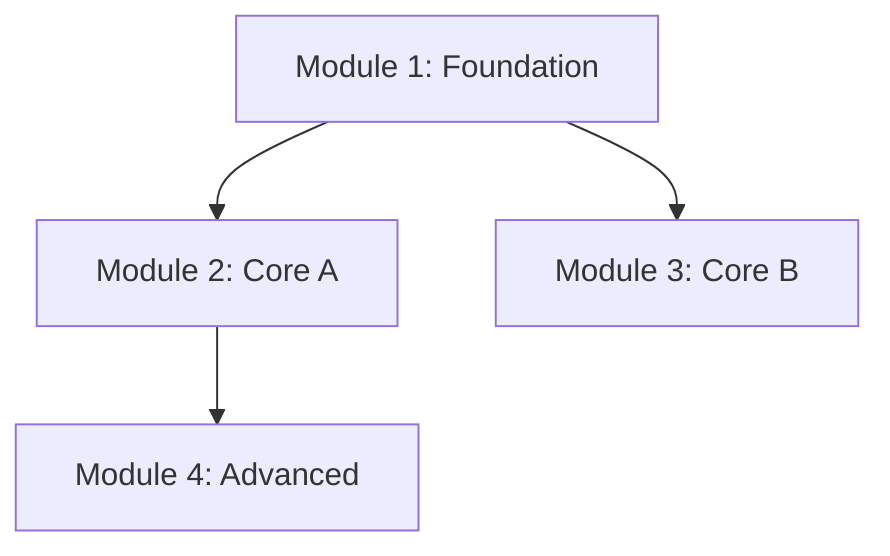

# Training Engine Implementation Plan

> **For agentic workers:** REQUIRED SUB-SKILL: Use superpowers:subagent-driven-development (recommended) or superpowers:executing-plans to implement this plan task-by-task. Steps use checkbox (`- [ ]`) syntax for tracking.

**Goal:** Xây dựng plugin Claude Code "training-engine" tách skill monolithic van-tu-tu-training thành framework modular 8 skills + method plugin system.

**Architecture:** Pipeline 6 phase (init → research → analyze → plan → build → review) + 1 conductor + 1 method library. Mỗi phase là skill độc lập, ghi output vào project folder. Phương pháp sư phạm (Văn-Tư-Tu, ADDIE, ...) là plugin cắm vào pipeline qua method manifest.

**Tech Stack:** Claude Code plugin system (SKILL.md prompts), markdown files, JSON state (project.json)

**Spec:** `docs/superpowers/specs/2026-05-07-training-engine-design.md`

**Paths:**
- `$REPO` = `/Users/tuanhv/Desktop/git_projects/training-engine`
- `$SRC` = `/Users/tuanhv/Desktop/git_projects/shun_claude_plugin/skills/van-tu-tu-training`

---

### Task 1: Repo Scaffold

**Files:**
- Create: `$REPO/.claude-plugin/plugin.json`
- Create: `$REPO/CLAUDE.md`
- Create: All skill directories (empty)

- [ ] **Step 1: Init repo + create directory tree**

```bash
mkdir -p /Users/tuanhv/Desktop/git_projects/training-engine
cd /Users/tuanhv/Desktop/git_projects/training-engine
git init
mkdir -p .claude-plugin
mkdir -p skills/training
mkdir -p skills/training-init/references
mkdir -p skills/training-research/references
mkdir -p skills/training-analyze/references
mkdir -p skills/training-plan/references
mkdir -p skills/training-build/references
mkdir -p skills/training-review/references
mkdir -p skills/training-methods/van-tu-tu/references
mkdir -p skills/training-methods/van-tu-tu/templates
mkdir -p skills/training-methods/_template
```

- [ ] **Step 2: Create plugin.json**

Write `$REPO/.claude-plugin/plugin.json`:

```json
{
  "name": "training-engine",
  "description": "Framework xây dựng tài liệu training với phương pháp sư phạm pluggable",
  "version": "1.0.0",
  "skills": [
    {
      "name": "training",
      "description": "Conductor: quản lý pipeline xây dựng training từ init đến review. Entry point chính. Dùng khi user muốn bắt đầu hoặc tiếp tục dự án training, xem trạng thái pipeline, hoặc nhảy tới bất kỳ phase nào."
    },
    {
      "name": "training-init",
      "description": "Khởi tạo dự án training: chọn phương pháp sư phạm, trả lời brief questions, tạo project folder. Dùng khi bắt đầu dự án training mới."
    },
    {
      "name": "training-research",
      "description": "Nghiên cứu và trích xuất nội dung từ tài liệu nguồn (PDF, DOCX, URL, YouTube, text). Output: content inventory phân loại theo taxonomy của method. Dùng sau khi đã có brief (training-init)."
    },
    {
      "name": "training-analyze",
      "description": "Phân tích content inventory, tách module độc lập, xếp tier (Foundation/Core/Advanced/Specialized), vẽ prerequisite map, kiểm tra coverage. Dùng sau khi đã có content inventory (training-research)."
    },
    {
      "name": "training-plan",
      "description": "Thiết kế từng module: chọn ratio, direction, guidance level, deliverable theo method config. Dùng sau khi đã có module map (training-analyze)."
    },
    {
      "name": "training-build",
      "description": "Sinh nội dung từng module theo templates của method, kèm facilitator hub và đánh giá khoá. Dùng sau khi đã có module designs (training-plan)."
    },
    {
      "name": "training-review",
      "description": "Review chất lượng toàn bộ khoá: quality checklist, naming, GDocs compat, failure modes, brief alignment. Dùng sau khi đã có nội dung (training-build)."
    },
    {
      "name": "training-methods",
      "description": "Thư viện phương pháp sư phạm. Xem danh sách methods có sẵn, so sánh methods, hoặc hướng dẫn tạo method mới từ template."
    }
  ]
}
```

- [ ] **Step 3: Create CLAUDE.md**

Write `$REPO/CLAUDE.md`:

```markdown
# Training Engine

Plugin Claude Code xây dựng tài liệu training với phương pháp sư phạm pluggable.

## Cấu trúc

```
skills/
  training/              Conductor (entry point)
  training-init/         Phase 1: Khởi tạo dự án + brief
  training-research/     Phase 2: Nghiên cứu nội dung nguồn
  training-analyze/      Phase 3: Phân tích + tách module
  training-plan/         Phase 4: Thiết kế từng module
  training-build/        Phase 5: Sinh nội dung
  training-review/       Phase 6: Review + validation
  training-methods/      Thư viện phương pháp sư phạm
    van-tu-tu/           Method: Văn-Tư-Tu (default)
    _template/           Template tạo method mới
```

## Pipeline

```
training-init → training-research → training-analyze → training-plan → training-build → training-review
```

Mỗi phase đọc output phase trước từ `training-projects/<slug>/`. Có thể chạy riêng hoặc qua conductor (`/training`).

## State

Mỗi dự án training lưu state tại `training-projects/<slug>/project.json` trong CWD của user. Không lưu trong plugin.

## Method Plugin

Phương pháp sư phạm là plugin cắm vào pipeline. Mỗi method có `method.md` (manifest) + `references/` + `templates/`. Tạo method mới bằng cách copy `_template/`.

## Quy tắc

- Pipeline skills không chứa logic đặc thù method. Mọi thứ method-specific nằm trong `training-methods/<method-id>/`
- Mỗi skill ghi output vào file cố định. Skill sau đọc file trước
- Chạy lại phase sẽ ghi đè output cũ
```

- [ ] **Step 4: Verify + commit**

```bash
cd /Users/tuanhv/Desktop/git_projects/training-engine
find . -type f | head -20
git add -A
git commit -m "feat: init repo scaffold with plugin.json and CLAUDE.md"
```

Expected: 2 files committed, directory structure created.

---

### Task 2: Method Plugin System Foundation

**Files:**
- Create: `$REPO/skills/training-methods/SKILL.md`
- Create: `$REPO/skills/training-methods/_template/method.md`
- Create: `$REPO/skills/training-methods/_template/README.md`

- [ ] **Step 1: Create training-methods SKILL.md**

Write `$REPO/skills/training-methods/SKILL.md`:

```markdown
---
name: training-methods
description: "Thư viện phương pháp sư phạm. Xem danh sách methods có sẵn hoặc hướng dẫn tạo method mới."
---

# Training Methods: Thư viện Phương pháp Sư phạm

## Nhiệm vụ

Hiển thị danh sách phương pháp sư phạm (methods) có sẵn và hướng dẫn tạo method mới.

## Quy trình

### 1. Quét danh sách methods

Đọc thư mục `skills/training-methods/`. Mỗi thư mục con (trừ `_template/`) là 1 method. Đọc `method.md` trong mỗi thư mục để lấy metadata.

### 2. Hiển thị danh sách

Với mỗi method, hiển thị:

| Method | Mô tả | Triết lý | Module Phases | Directions |
|--------|-------|----------|---------------|------------|
| (đọc từ method.md § Metadata.id) | (§ Metadata.origin) | (§ Philosophy, tóm tắt 1 câu) | (§ Module Phases, liệt kê tên) | (§ Directions, liệt kê tên) |

### 3. Nếu user hỏi tạo method mới

Hướng dẫn 5 bước:

1. Copy thư mục `skills/training-methods/_template/` sang tên method mới (kebab-case)
2. Mở `method.md` trong thư mục mới, điền tất cả sections
3. Tạo `references/` nếu method có tài liệu tham khảo
4. Tạo `templates/` với 1 template per module phase
5. Test: chạy `/training-init`, chọn method mới, verify brief questions load đúng

Chi tiết từng section: đọc `skills/training-methods/_template/README.md`.

### 4. Nếu user hỏi so sánh methods

Tạo bảng so sánh dựa trên method.md của mỗi method:
- Triết lý nền tảng
- Module phases + ratio mặc định
- Directions có sẵn
- Đối tượng phù hợp nhất (đọc từ § Directions)
```

- [ ] **Step 2: Create _template/method.md**

Write `$REPO/skills/training-methods/_template/method.md`:

```markdown
# Method: [TÊN PHƯƠNG PHÁP]

## Metadata
- id: [kebab-case, vd: bloom-taxonomy]
- version: 1.0.0
- origin: [Xuất xứ, vd: Benjamin Bloom, 1956]

## Philosophy
[Mô tả triết lý sư phạm cốt lõi, 3-5 câu. Phương pháp này tin gì về cách con người học? Nguyên lý nào chi phối thiết kế?]

## Module Phases
Định nghĩa các phase bên trong 1 module. Mỗi phase = 1 giai đoạn học tập.

- [phase-id] ([Tên phase]): [% mặc định]
  - Mô tả: [Phase này dạy/làm gì]
  - Template: templates/[file].md

Ví dụ cho Văn-Tư-Tu:
- van (Kiến thức): 10%
- tu-suy-tu (Suy tư): 20%
- tu-thuc-hanh (Thực hành): 70%
- danh-gia (Đánh giá): xuyên suốt

## Directions
Thứ tự các phase có thể chạy. Ít nhất 1 direction.

- [direction-id]: [phase-1] → [phase-2] → ... | Cho [đối tượng nào]

## Ratio Adjustments
Bảng điều chỉnh ratio theo content type, learner level, duration.
Nếu bảng dài, tách sang `references/ratio-table.md` và ghi đường dẫn ở đây.

| Yếu tố | Điều chỉnh |
|---------|-----------|
| [Content type] | [Ratio mới] |
| [Learner level] | [Ratio mới] |

## Brief Questions (Hook: init)
Câu hỏi bổ sung khi khởi tạo dự án (ngoài 5 câu generic của pipeline).
Ghi rõ: câu hỏi, mục đích, validation rule.

## Content Taxonomy (Hook: research)
Phân loại nội dung khi trích xuất. Mỗi loại = 1 ký hiệu.

| Ký hiệu | Loại | Mô tả |
|----------|------|-------|
| [CODE] | [Tên] | [Mô tả + ví dụ] |

## Module Criteria (Hook: analyze)
Tiêu chí bổ sung khi tách module (ngoài 5 tiêu chí generic).

## Quality Criteria (Hook: review)
Tiêu chí chất lượng per module. Mỗi tiêu chí có thang đo rõ ràng.

| # | Tiêu chí | Câu hỏi kiểm tra | Thang |
|---|----------|-------------------|-------|
| 1 | [Tên] | [Câu hỏi] | [Có/Không hoặc 1-5] |

## Failure Modes (Hook: review)
Bẫy thường gặp khi dùng method này.

| Bẫy | Triệu chứng | Cách thoát |
|-----|-------------|------------|
| [Tên bẫy] | [Dấu hiệu nhận biết] | [Hành động sửa] |

## Build Order (Hook: build)
Thứ tự viết nội dung tối ưu cho 1 module.

1. [File đầu tiên] (lý do viết trước)
2. [File tiếp theo] (lý do)
```

- [ ] **Step 3: Create _template/README.md**

Write `$REPO/skills/training-methods/_template/README.md`:

```markdown
# Hướng dẫn tạo Method mới

## Bước 1: Copy template

```bash
cp -r skills/training-methods/_template skills/training-methods/<method-id>
```

`<method-id>` phải là kebab-case, không dấu tiếng Việt. Ví dụ: `bloom-taxonomy`, `addie-model`, `four-cs`.

## Bước 2: Điền method.md

Mở `method.md` trong thư mục mới. Điền TẤT CẢ sections. Không để placeholder.

### Hướng dẫn từng section:

**Metadata**: id khớp tên thư mục. Version bắt đầu 1.0.0.

**Philosophy**: Ngắn gọn, 3-5 câu. Trả lời: "Phương pháp này tin gì về cách con người học?"

**Module Phases**: Liệt kê giai đoạn học tập trong 1 module. Mỗi phase có % mặc định (tổng = 100%). Mỗi phase trỏ đến 1 template file.

**Directions**: Ít nhất 1. Mỗi direction = 1 thứ tự chạy các phases. Ghi rõ cho đối tượng nào.

**Ratio Adjustments**: Bảng lookup. Nếu dài, tách file riêng.

**Brief Questions**: Câu hỏi BỔ SUNG cho 5 câu generic. Nếu method không cần thêm câu hỏi, ghi "Không có câu hỏi bổ sung."

**Content Taxonomy**: Bảng phân loại nội dung. Ít nhất 3 loại.

**Module Criteria**: Tiêu chí tách module BỔ SUNG cho 5 tiêu chí generic. Nếu không cần thêm, ghi "Dùng 5 tiêu chí generic."

**Quality Criteria**: Bảng tiêu chí chất lượng. Ít nhất 4 tiêu chí.

**Failure Modes**: Bảng bẫy thường gặp. Ít nhất 3 bẫy.

**Build Order**: Thứ tự viết files trong 1 module. Phải match với phases đã định nghĩa.

## Bước 3: Tạo references/ (tuỳ chọn)

Nếu method có tài liệu tham khảo (triết lý chi tiết, bảng ratio mở rộng, hướng dẫn facilitation), tạo thư mục `references/` và đặt file vào đó. Reference từ `method.md` bằng đường dẫn tương đối.

## Bước 4: Tạo templates/

Tạo 1 template file per module phase đã định nghĩa trong method.md § Module Phases. Mỗi template hướng dẫn cách viết nội dung cho phase đó.

## Bước 5: Test

1. Chạy `/training-init`
2. Chọn method mới từ danh sách
3. Verify: brief questions method-specific xuất hiện đúng
4. Chạy qua pipeline đến `/training-build`
5. Verify: templates method load đúng, nội dung sinh ra đúng cấu trúc
```

- [ ] **Step 4: Commit**

```bash
cd /Users/tuanhv/Desktop/git_projects/training-engine
git add skills/training-methods/
git commit -m "feat: add method plugin system with template and guide"
```

---

### Task 3: Văn-Tư-Tu Method Manifest

**Files:**
- Create: `$REPO/skills/training-methods/van-tu-tu/method.md`

- [ ] **Step 1: Create method.md**

Write `$REPO/skills/training-methods/van-tu-tu/method.md`:

```markdown
# Method: Văn-Tư-Tu (Tam Tuệ Học)

## Metadata
- id: van-tu-tu
- version: 1.0.0
- origin: Tam Tuệ Học (三慧學) trong Phật giáo, 2.600 năm. Sanskrit: Śruta-Cintā-Bhāvanā

## Philosophy

Đào tạo không phải chuyển kiến thức từ sách vào đầu. Đào tạo là chuyển kiến thức qua đầu, vào tay, thành hành vi. Mô hình Văn-Tư-Tu chia tiến trình học thành 3 giai đoạn: Văn (tiếp nhận, 10%), Tư (tiêu hoá, 20%), Tu (chuyển hoá, 70%). Phần "Hoá" (Tư + Tu) chiếm 90% nỗ lực. Sau Tu, quay lại Văn ở cấp sâu hơn, tạo vòng lặp xoắn ốc.

Chi tiết triết lý: đọc `references/philosophy.md`

## Module Phases

- van (Kiến thức nền tảng): 10%
  - Mô tả: Tiếp nhận kiến thức, tinh gọn, chỉ giữ cái cần cho Tư và Tu
  - Template: templates/van.md
- tu-suy-tu (Suy tư và phân tích): 20%
  - Mô tả: Tiêu hoá kiến thức, đặt câu hỏi, liên hệ bản thân, phản chiếu
  - Template: templates/tu-suy-tu.md
- tu-thuc-hanh (Thực hành và chuyển hoá): 70%
  - Mô tả: Sống với kiến thức, thực hành, đúc kết, chuyển hoá thành hành vi
  - Template: templates/tu-thuc-hanh.md
- danh-gia (Đánh giá): xuyên suốt
  - Mô tả: Rubric, After-Action Review, follow-up 30/60/90 ngày
  - Template: templates/danh-gia.md

## Directions

- traditional: van → tu-suy-tu → tu-thuc-hanh | Cho người mới, cần framework trước khi thực hành
- constructivist: tu-thuc-hanh → tu-suy-tu → van | Cho người có nền tảng, chủ đề trải nghiệm (leadership, sáng tạo). Xuất phát chậm, về đích trước, hành vi thay đổi sâu hơn

## Ratio Adjustments

Chi tiết: đọc `references/ratio-table.md`

Tóm tắt nhanh:

| Loại nội dung | Văn | Tư | Tu |
|---------------|-----|----|----|
| Kỹ năng kỹ thuật (code, tool) | 15% | 10% | 75% |
| Kỹ năng mềm (giao tiếp, lãnh đạo) | 10% | 30% | 60% |
| Tuân thủ / An toàn | 25% | 15% | 60% |
| Tư duy chiến lược | 15% | 35% | 50% |
| Onboarding | 20% | 15% | 65% |
| Mặc định | 10% | 20% | 70% |

## Brief Questions (Hook: init)

Ngoài 5 câu generic, thêm:

1. **Value prop check**: "Nếu KHÔNG có khoá này, họ mất bao lâu để tự mò ra?" Nếu trả lời "vài ngày Google" thì khoá có thể không cần. Mục đích: loại bỏ training không cần thiết sớm.
2. **Retention metric**: "Sau 3 tháng, họ còn đọng lại được gì?" Đo bằng follow-up quiz / behaviour spot-check / interview ngắn. Mục đích: đảm bảo metric dài hạn, không chỉ ngắn hạn.
3. **Chiều đi sơ bộ**: Dựa trên level người học (câu 3 generic), đề xuất traditional (Văn→Tư→Tu) hay constructivist (Tu→Tư→Văn). Chốt chính thức ở phase plan.

## Content Taxonomy (Hook: research)

| Ký hiệu | Loại | Ví dụ |
|----------|------|-------|
| **K** | Kiến thức (khái niệm, định nghĩa, framework) | "SBI gồm 3 bước: Situation-Behavior-Impact" |
| **N** | Nguyên tắc (quy tắc, mindset, giá trị) | "Feedback phải kịp thời, không để qua 48h" |
| **T** | Kỹ thuật (cách làm, quy trình, tool) | "Dùng câu hỏi mở thay vì phán xét" |
| **V** | Ví dụ / Câu chuyện (case, minh hoạ) | Câu chuyện CEO nhận feedback từ intern |
| **C** | Cảnh báo / Sai lầm (anti-pattern, trap) | "Đừng feedback khi đang tức giận" |

## Module Criteria (Hook: analyze)

Ngoài 5 tiêu chí generic, thêm:

1. **Micro-cycle check**: Mỗi hoạt động bên trong module phải có đủ 3 bước mini Văn-Tư-Tu (fractal). Bài thực hành 1 giờ = 5' đọc + 10' phân tích + 30' làm + 15' đúc kết.
2. **Direction consistency**: Mọi module cùng tier nên dùng cùng direction (tránh lẫn lộn cho học viên).

## Quality Criteria (Hook: review)

| # | Tiêu chí | Câu hỏi kiểm tra | Thang |
|---|----------|-------------------|-------|
| 1 | Cốt lõi | Module có 1 thông điệp chi phối tất cả, bỏ đi thì module sụp? | Có/Không |
| 2 | Giải thích lực | Phần Văn giúp người không biết gì hiểu trong bao nhiêu %? | 1-5 |
| 3 | Dự đoán lực | Người học áp dụng module này dự đoán được tình huống mới? | 1-5 |
| 4 | Truyền đạt | Người đã học xong giải thích cho đồng nghiệp trong 2 phút? | 1-5 |
| 5 | Hành động | Sau module, người học biết CHÍNH XÁC phải làm gì, ở đâu, khi nào? | Có/Không |
| 6 | Brief alignment | Map rõ ít nhất 1 outcome + 1 metric từ Brief? Deliverable verify được metric? | Có/Không |

Module đạt khi: tiêu chí 1, 5, 6 = Có, trung bình 2-3-4 ≥ 3/5.

## Failure Modes (Hook: review)

| Bẫy | Triệu chứng | Cách thoát |
|-----|-------------|------------|
| Văn phình to | Module Văn > 20 phút đọc / > 10 trang | Cắt mọi đoạn không cần cho Tư-Tu. Hỏi: "Bỏ đoạn này, người học còn làm bài thực hành được không?" |
| Tu làm cho có | Bài thực hành chỉ là bài tập viết, không có hành động thực tế, không AAR, không đo 30/60/90 | Mỗi bài Tu: hành động cụ thể + bằng chứng verify + câu hỏi đúc kết |
| Module đá nhau | Prerequisite không ghi rõ, dính chùm > 3 module | Vẽ prerequisite map. Dính chùm > 3 → tách lại |
| Tóm tắt giả đúc kết | Đúc kết chỉ liệt kê 3 ý chính, không tìm lõi | Tìm LÕI chi phối: bỏ 1 ý, cả module vẫn đứng được → chưa phải lõi |
| Tài liệu đẹp, hành vi không đổi | Survey cuối khoá 9/10 nhưng sau 60 ngày tỷ lệ áp dụng < 30% | Kiểm tra Tu: action rõ chưa? Môi trường có? Follow-up có? |

## Build Order (Hook: build)

Thứ tự viết tối ưu cho 1 module:

1. README.md (thẻ căn cước module, viết trước để lock scope)
2. 03-tu-thuc-hanh/ (70% giá trị, viết bài thực hành + dự án trước)
3. 02-tu-suy-tu/ (câu hỏi phản chiếu, case study, nhật ký)
4. 01-van/ (chỉ kiến thức CẦN CHO Tư và Tu, không thêm)
5. 04-danh-gia/ (rubric, AAR template)
6. Cross-check Content Inventory (mọi ý gán cho module phải xuất hiện)

## Lăng kính xuyên suốt

3 nguyên tắc áp dụng ở MỌI bước:

| Lăng kính | Câu hỏi |
|-----------|---------|
| Nhân quả xa hơn gần | Quick fix hôm nay có giết năng lực học dài hạn không? |
| Ba gốc hơn ba độc | Hoạt động đẩy người học về Giác-Từ-Tĩnh hay Tham-Sân-Si? |
| Độc lập hơn hoàn chỉnh | Module đứng một mình có giá trị không? |

Rule khi xung đột: ưu tiên Nhân quả xa.

## Facilitation

Chi tiết: đọc `references/facilitation.md`
```

- [ ] **Step 2: Commit**

```bash
cd /Users/tuanhv/Desktop/git_projects/training-engine
git add skills/training-methods/van-tu-tu/method.md
git commit -m "feat: add Văn-Tư-Tu method manifest"
```

---

### Task 4: Văn-Tư-Tu References Migration

**Files:**
- Create: `$REPO/skills/training-methods/van-tu-tu/references/philosophy.md` (from philosophy-foundation.md lines 1-71)
- Create: `$REPO/skills/training-methods/van-tu-tu/references/facilitation.md` (from philosophy-foundation.md lines 72-138)
- Create: `$REPO/skills/training-methods/van-tu-tu/references/ratio-table.md` (copy ratio-adjustment.md)
- Create: `$REPO/skills/training-methods/van-tu-tu/references/failure-modes.md` (extract from SKILL.md)

- [ ] **Step 1: Split philosophy-foundation.md into philosophy.md**

Read `$SRC/references/philosophy-foundation.md`. Copy lines 1-71 (sections 1-4: Mô Hình, Văn Hoá, Hai Chiều Đi, Tỷ Lệ) to `$REPO/skills/training-methods/van-tu-tu/references/philosophy.md`.

Edit the reference at line 70 to point to the new path:
- Old: `references/ratio-adjustment.md`
- New: `references/ratio-table.md`

- [ ] **Step 2: Extract facilitation.md**

Copy lines 72-138 from `$SRC/references/philosophy-foundation.md` (Section 5: Nguyên Tắc Facilitation) to `$REPO/skills/training-methods/van-tu-tu/references/facilitation.md`.

Edit the reference at line 115 to point to the new path:
- Old: `references/ratio-adjustment.md`
- New: `references/ratio-table.md`

- [ ] **Step 3: Copy ratio-adjustment.md**

```bash
cp "$SRC/references/ratio-adjustment.md" "$REPO/skills/training-methods/van-tu-tu/references/ratio-table.md"
```

No edits needed. Content is self-contained.

- [ ] **Step 4: Create failure-modes.md**

Extract failure modes from SKILL.md (lines 46-58) into standalone file.

Write `$REPO/skills/training-methods/van-tu-tu/references/failure-modes.md`:

```markdown
# Failure Modes: 5 Bẫy Phải Tránh

Khi thiết kế bộ tài liệu, chủ động kiểm tra không rơi vào 5 bẫy sau. Mỗi bẫy có triệu chứng + cách thoát.

| Bẫy | Triệu chứng | Cách thoát |
|-----|-------------|------------|
| **Văn phình to** | Module Văn > 20 phút đọc / > 10 trang, nhiều khái niệm không dẫn tới Tư-Tu nào cụ thể | Cắt mọi đoạn không trả lời được câu "Bỏ đoạn này người học còn làm bài thực hành được không?" |
| **Tu làm cho có** | Bài thực hành chỉ là bài tập viết, không có hành động thực tế, không có AAR, không đo hành vi sau 30/60/90 ngày | Mỗi bài Tu phải có: hành động cụ thể + bằng chứng verify + câu hỏi đúc kết |
| **Module đá nhau** | Không học module trước không hiểu module sau, nhưng prerequisite không ghi rõ | Vẽ prerequisite map. Nếu dính chùm > 3 module → tách lại |
| **Tóm tắt giả đúc kết** | Đúc kết module chỉ là liệt kê lại 3 ý chính đã học | Tìm LÕI chi phối (bỏ đi thử, câu hỏi đệ quy). Bỏ 1 ý mà cả module vẫn đứng được → ý đó chưa phải lõi |
| **Tài liệu đẹp, hành vi không đổi** | Survey cuối khoá điểm cao, nhưng sau 60 ngày tỷ lệ áp dụng < 30% | Kiểm tra lại Tu: có action rõ chưa? Có môi trường áp dụng không? Có follow-up không? |

## Quy tắc sử dụng

Sau khi draft xong module, đọc lại và tick từng bẫy. Dính bẫy nào → sửa bẫy đó trước khi qua module tiếp.
```

- [ ] **Step 5: Verify + commit**

```bash
cd /Users/tuanhv/Desktop/git_projects/training-engine
ls skills/training-methods/van-tu-tu/references/
# Expected: facilitation.md  failure-modes.md  philosophy.md  ratio-table.md
git add skills/training-methods/van-tu-tu/references/
git commit -m "feat: migrate Văn-Tư-Tu references (philosophy, facilitation, ratio, failure modes)"
```

---

### Task 5: Văn-Tư-Tu Templates Migration

**Files:**
- Copy: 5 template files from `$SRC/references/` to `$REPO/skills/training-methods/van-tu-tu/templates/`
- Create: `$REPO/skills/training-methods/van-tu-tu/templates/module-structure.md`

- [ ] **Step 1: Copy 5 template files**

```bash
SRC="/Users/tuanhv/Desktop/git_projects/shun_claude_plugin/skills/van-tu-tu-training/references"
DEST="/Users/tuanhv/Desktop/git_projects/training-engine/skills/training-methods/van-tu-tu/templates"

cp "$SRC/template-van.md" "$DEST/van.md"
cp "$SRC/template-tu-suy-tu.md" "$DEST/tu-suy-tu.md"
cp "$SRC/template-tu-thuc-hanh.md" "$DEST/tu-thuc-hanh.md"
cp "$SRC/template-danh-gia.md" "$DEST/danh-gia.md"
cp "$SRC/template-facilitator-hub.md" "$DEST/facilitator-hub.md"
```

No content edits needed. Files are self-contained.

- [ ] **Step 2: Create module-structure.md**

Write `$REPO/skills/training-methods/van-tu-tu/templates/module-structure.md`:

```markdown
# Cấu trúc Module Văn-Tư-Tu

Mỗi module training theo phương pháp Văn-Tư-Tu có cấu trúc thư mục sau:

```
module-XX-<slug>/
  README.md                              Thẻ căn cước module
  01-van/                                Kiến thức nền tảng (10%)
    tai-lieu-chinh.md                    Nội dung chính
    tom-tat.md                           Tóm tắt 1 trang
    kiem-tra-kien-thuc.md                5-10 câu hỏi tự kiểm tra
  02-tu-suy-tu/                          Suy tư và phân tích (20%)
    cau-hoi-phan-chieu.md                5-7 câu hỏi phản chiếu
    tinh-huong.md                        Case study (200-400 từ)
    nhat-ky-phan-tu.md                   Template nhật ký phản tư
  03-tu-thuc-hanh/                       Thực hành và chuyển hoá (70%)
    bai-thuc-hanh-co-huong-dan.md        Bài thực hành có hướng dẫn (1-2 giờ)
    du-an-thuc-te.md                     Dự án thực tế (1-2 tuần)
    checklist-hanh-dong.md               Checklist hành động hàng ngày
  04-danh-gia/                           Đánh giá
    rubric.md                            Rubric 3 mức (Văn-Tư-Tu)
    aar.md                               After-Action Review template
```

## README.md (bắt buộc mỗi module)

Chứa:
- Metadata: tier, duration, prerequisite, learning objectives
- Tỷ lệ Văn-Tư-Tu (%) + thời lượng breakdown
- Links tới 4 phase folders
- Liên kết: quay về tổng quan + module prerequisite + module tiếp theo

## Files meta (khoá học, không thuộc module)

```
_facilitator-hub/
  huong-dan-chung.md                     Hướng dẫn facilitation chung
  so-do-module.md                        Prerequisite map (Mermaid)
  lich-trinh-goi-y.md                    Lịch trình gợi ý (cá nhân/nhóm/tổ chức)

_danh-gia-khoa/
  survey-cuoi-khoa.md                    Survey Likert 1-5
  follow-up-30-60-90.md                  Check-in sau 30/60/90 ngày
```

## Quy tắc đặt tên

- Tiếng Việt không dấu, kebab-case
- Zero-pad 2 chữ số: `01-`, `02-`, không phải `1-`, `2-`
- Prefix `_` cho thư mục meta
- Links: relative markdown `[label](../path/file.md)`

Chi tiết: đọc `skills/training-build/references/naming-convention.md`
```

- [ ] **Step 3: Verify + commit**

```bash
cd /Users/tuanhv/Desktop/git_projects/training-engine
ls skills/training-methods/van-tu-tu/templates/
# Expected: danh-gia.md  facilitator-hub.md  module-structure.md  tu-suy-tu.md  tu-thuc-hanh.md  van.md
git add skills/training-methods/van-tu-tu/templates/
git commit -m "feat: migrate Văn-Tư-Tu templates and add module structure"
```

---

### Task 6: training-init Skill

**Files:**
- Create: `$REPO/skills/training-init/SKILL.md`
- Create: `$REPO/skills/training-init/references/brief-template.md` (generic part from template-training-brief.md)
- Create: `$REPO/skills/training-init/references/validation-rules.md`

- [ ] **Step 1: Create SKILL.md**

Write `$REPO/skills/training-init/SKILL.md`:

```markdown
---
name: training-init
description: "Khởi tạo dự án training: chọn phương pháp sư phạm, trả lời brief questions, tạo project folder."
---

# Training Init: Khởi tạo dự án Training

## Nhiệm vụ

Tạo dự án training mới: chọn phương pháp sư phạm, thu thập thông tin qua brief questions, tạo project folder với state ban đầu.

## Quy trình

### 1. Xác định project

Hỏi user: "Tên dự án training?" (ngắn gọn, vd: "feedback-cho-leader", "onboarding-dev")
Chuyển thành kebab-case, không dấu tiếng Việt → dùng làm `<slug>`.

Kiểm tra `training-projects/<slug>/` trong CWD:
- Nếu đã tồn tại → thông báo, hỏi dùng lại hay tạo slug khác
- Nếu chưa → tiếp bước 2

### 2. Chọn phương pháp sư phạm (method)

Quét `skills/training-methods/` (thư mục plugin, KHÔNG phải CWD). Mỗi thư mục con (trừ `_template/`) là 1 method. Đọc `method.md` trong mỗi thư mục → lấy `§ Metadata.id` + `§ Philosophy` (tóm 1 câu).

Hiển thị danh sách, đánh dấu mặc định:

> **Chọn phương pháp sư phạm:**
> 1. **van-tu-tu** (mặc định): Tam Tuệ Học, 10-20-70 Văn-Tư-Tu
> 2. [method khác nếu có]

User chọn → ghi nhận `method_id`.

### 3. Tạo project folder

```bash
mkdir -p training-projects/<slug>
```

### 4. Thu thập Brief

#### 4a. 5 câu hỏi generic (bắt buộc mọi method)

Hỏi TỪNG CÂU, validate ngay, không gộp nhiều câu:

1. **Chủ đề**: "Training này dạy gì?" (1-2 câu, cấm từ mơ hồ như "kỹ năng mềm", "soft skills")
2. **Outcome**: "Sau khoá, người học LÀM ĐƯỢC GÌ?" Công thức: "Sau [thời gian], [X]% [nhóm cụ thể] có thể [hành động cụ thể] [tần suất], kiểm chứng bằng [bằng chứng]"
3. **Người học**: "Ai sẽ học?" Level (mới/có nền tảng/tiềm năng cao/expert) + tự chấm 1-10 + kiến thức hiện có + pain point lớn nhất
4. **Áp dụng**: "Họ áp dụng ở đâu, khi nào?" Tình huống công việc cụ thể + tần suất
5. **Metric**: "Đo thành công bằng gì?" Công thức: "[Chỉ số] đo bằng [công cụ], tại [thời điểm], đạt khi [ngưỡng]"

#### 4b. Câu hỏi method-specific

Đọc method manifest (`training-methods/<method_id>/method.md` § Brief Questions). Hỏi thêm các câu method yêu cầu.

#### 4c. 3 câu bối cảnh (trigger-based)

Hỏi khi cần bối cảnh rõ hơn, hoặc khi user chỉ có topic mơ hồ:

6. **Pain/Trigger**: "Vì sao mở khoá NGAY BÂY GIỜ?" (nỗi đau kinh doanh cụ thể)
7. **Ràng buộc**: Thời lượng + daily budget (phút/ngày) + format (online/offline/blended) + mức cần facilitator
8. **Tài liệu gốc**: Có sách/video/notes/framework sẵn? (quyết định phase research cần extraction hay build from scratch)

### 5. Validate

Áp dụng validation rules (đọc `references/validation-rules.md`). Tóm tắt thành Training Brief, check từng câu. Câu nào fail → đánh dấu "cần làm rõ", hỏi lại gộp 1 lần. Chỉ lock-in khi 5 câu Core đều đạt.

### 6. Làm giàu thông tin (nếu cần)

Khi topic quá mơ hồ (1-2 câu mô tả, không tài liệu gốc, không data nhóm học): dùng WebSearch bổ sung benchmark ngành, case study, trend. Gộp vào Brief mục "Bối cảnh và Research".

### 7. Ghi output

**File `00-brief.md`**: Dùng template trong `references/brief-template.md`. Điền câu trả lời đã validate. Thêm mục "Bối cảnh và Research" nếu có.

**File `project.json`**:

```json
{
  "name": "<slug>",
  "method": "<method_id>",
  "current_phase": "init",
  "phases": {
    "init": { "status": "done", "output": "00-brief.md" },
    "research": { "status": "pending" },
    "analyze": { "status": "pending" },
    "plan": { "status": "pending" },
    "build": { "status": "pending" },
    "review": { "status": "pending" }
  },
  "config": {},
  "created_at": "<YYYY-MM-DD>",
  "updated_at": "<YYYY-MM-DD>"
}
```

Đọc method manifest § Ratio Adjustments → ghi `config.default_ratio` và `config.default_direction`.

### 8. Kết thúc

Thông báo:
> Dự án `<slug>` đã khởi tạo tại `training-projects/<slug>/`.
> Tiếp theo: `/training-research` để nghiên cứu nội dung nguồn.
> Hoặc `/training` để xem dashboard.
```

- [ ] **Step 2: Create brief-template.md**

Read `$SRC/references/template-training-brief.md`. Extract generic sections (the template structure, scaffolding for generic questions, validation process, example). Remove Văn-Tư-Tu specific sections (direction choice, cause-effect lens mapping). Write to `$REPO/skills/training-init/references/brief-template.md`.

Cụ thể:
- Giữ: Template form 8 sections, scaffolding câu 2 (outcome formula) + câu 5 (metric formula), validation 3 tiêu chí, ví dụ hoàn chỉnh
- Loại bỏ: Mục "Chiều đi sơ bộ" (Văn-Tư-Tu specific, đã chuyển vào method.md), mục Nhân-Duyên-Quả lens (Văn-Tư-Tu specific)
- Thêm placeholder: "Câu hỏi method-specific: xem method manifest § Brief Questions"

- [ ] **Step 3: Create validation-rules.md**

Write `$REPO/skills/training-init/references/validation-rules.md`:

```markdown
# Validation Rules cho Training Brief

## 3 tiêu chí validate mỗi câu trả lời

Mỗi câu trong Brief phải đạt ít nhất 2/3 tiêu chí:

| # | Tiêu chí | Ví dụ đạt | Ví dụ fail |
|---|----------|-----------|-----------|
| 1 | **Số liệu cụ thể** | "80% nhân viên", "3 lần/tuần", "sau 30 ngày" | "nhiều người", "thường xuyên", "sớm" |
| 2 | **Danh từ cụ thể** | "M2 leaders", "SBI feedback", "1:1 meetings" | "nhân viên", "kỹ năng mềm", "giao tiếp" |
| 3 | **Chứng cứ kiểm chứng** | "verify qua log + HR spot-check", "đo bằng survey Likert" | "kiểm tra bằng cảm nhận", không có cách đo |

## Quy trình validate

1. Tóm tắt toàn bộ câu trả lời thành Training Brief 1 trang
2. Check TỪNG câu theo 3 tiêu chí
3. Câu fail → đánh dấu "cần làm rõ" với ghi chú cụ thể thiếu gì
4. Gộp tất cả câu fail → hỏi lại user 1 lần (không hỏi từng câu riêng rẽ)
5. Lặp lại cho đến khi 5 câu Core đều đạt

## Validate đặc biệt cho câu 2 (Outcome)

Phải theo công thức: "Sau [thời gian], [X]% [nhóm] có thể [hành động] [tần suất], verify bằng [chứng cứ]"

Thiếu bất kỳ thành phần nào → fail. Hỏi lại kèm ví dụ:
> "Sau 30 ngày, 80% M2 leaders có thể đưa SBI feedback 3 lần/tuần trong 1:1, verify qua feedback log + HR spot-check 10 buổi ngẫu nhiên."

## Validate đặc biệt cho câu 5 (Metric)

Phải theo công thức: "[Chỉ số] đo bằng [công cụ], tại [thời điểm], đạt khi [ngưỡng]"

Thiếu thành phần nào → fail. Ví dụ:
> "Tỷ lệ SBI adoption đo bằng self-report + spot-check 10 buổi 1:1 ngẫu nhiên, tại 90 ngày, đạt khi ≥ 60%."
```

- [ ] **Step 4: Verify + commit**

```bash
cd /Users/tuanhv/Desktop/git_projects/training-engine
ls skills/training-init/
ls skills/training-init/references/
git add skills/training-init/
git commit -m "feat: add training-init skill with brief template and validation rules"
```

---

### Task 7: training-research Skill

**Files:**
- Create: `$REPO/skills/training-research/SKILL.md`
- Create: `$REPO/skills/training-research/references/extraction-guide.md`
- Create: `$REPO/skills/training-research/references/source-formats.md`

- [ ] **Step 1: Create SKILL.md**

Write `$REPO/skills/training-research/SKILL.md`:

```markdown
---
name: training-research
description: "Nghiên cứu và trích xuất nội dung từ tài liệu nguồn. Output: content inventory."
---

# Training Research: Nghiên cứu Nội dung

## Nhiệm vụ

Trích xuất nội dung từ tài liệu nguồn, phân loại theo taxonomy của method, xác định khoảng trống, bổ sung research. Output: content inventory đầy đủ.

## Yêu cầu đầu vào

- `training-projects/<slug>/project.json` tồn tại, `phases.init.status` = "done"
- `training-projects/<slug>/00-brief.md` tồn tại
- Nếu không tồn tại → thông báo: "Cần chạy `/training-init` trước."

## Quy trình

### 1. Đọc state

Đọc `project.json` → lấy `method` id. Đọc `00-brief.md` → hiểu scope, outcome, learner, metric.

### 2. Rẽ nhánh

- Nếu Brief câu 8 ghi "có tài liệu gốc" → hỏi user cung cấp → bước 3
- Nếu "không có tài liệu" → bỏ qua bước 3, chuyển thẳng bước 4

### 3. Trích xuất nội dung gốc (Content Extraction)

Đọc tài liệu nguồn. Hỗ trợ formats: đọc `references/source-formats.md`.

Cho mỗi tài liệu:
1. Đọc/phân tích toàn bộ, không bỏ sót
2. Liệt kê mọi ý chính, mỗi ý 1 dòng, giữ nguyên ngữ nghĩa gốc
3. Phân loại theo taxonomy của method

Đọc method manifest (`training-methods/<method_id>/method.md` § Content Taxonomy) → lấy bảng phân loại.

Quy trình trích xuất chi tiết: đọc `references/extraction-guide.md`.

### 4. Bổ sung research (nếu thiếu)

So sánh inventory với Brief:
- Brief outcome (câu 2) cần kiến thức gì? Inventory có đủ không?
- Brief metric (câu 5) cần skill gì? Inventory có đủ không?

Nếu thiếu → dùng WebSearch, deep-research, hoặc kiến thức chuyên môn bổ sung. Ghi nguồn = "research" trong inventory.

### 5. Ghi output

Ghi `training-projects/<slug>/01-content-inventory.md`:

```markdown
# Content Inventory: <tên dự án>

**Method**: <method_id>
**Tổng ý chính**: <số>
**Nguồn**: <danh sách tài liệu>

## Bảng Inventory

| # | Ý chính | Loại | Nguồn | Ghi chú |
|---|---------|------|-------|---------|
| 1 | [ý chính] | [ký hiệu] | [tài liệu, trang/phút] | [ghi chú] |
| 2 | ... | ... | ... | ... |

## Khoảng trống đã bổ sung

| # | Ý bổ sung | Loại | Lý do bổ sung |
|---|-----------|------|---------------|
```

### 6. Cập nhật state

Cập nhật `project.json`:
- `phases.research.status` = "done"
- `phases.research.output` = "01-content-inventory.md"
- `current_phase` = "research"
- `updated_at` = ngày hôm nay

### 7. Kết thúc

> Content inventory hoàn thành: <N> ý chính từ <M> nguồn.
> Tiếp theo: `/training-analyze` để phân tích và tách module.
```

- [ ] **Step 2: Create extraction-guide.md**

Write `$REPO/skills/training-research/references/extraction-guide.md`:

```markdown
# Hướng dẫn Trích xuất Nội dung

## Nguyên tắc trích xuất

1. **Bao phủ 100%**: Đọc toàn bộ tài liệu, không bỏ sót phần nào
2. **Giữ nguyên nghĩa**: Mỗi ý ghi lại đúng ý tác giả, không diễn giải lại
3. **Nguyên tử hoá**: 1 dòng = 1 ý chính. Đoạn chứa 3 ý → tách thành 3 dòng
4. **Ghi nguồn**: Mỗi ý ghi rõ nguồn (tên tài liệu + trang/phút/đoạn)

## Quy trình cho tài liệu lớn (> 50 trang)

### Tier 1: Standard (< 50 trang / < 50.000 từ)
Đọc và trích xuất trực tiếp.

### Tier 2: Medium (50-100 trang / 50-100K từ)
1. Đọc mục lục + tóm tắt chương trước
2. Chia thành batches (mỗi batch 20-30 trang)
3. Trích xuất từng batch
4. Merge + loại trùng lặp

### Tier 3: Large (> 100 trang / > 100K từ)
1. Đọc mục lục + tóm tắt + kết luận trước
2. Xác định chương nào phục vụ Brief outcome/metric
3. Ưu tiên trích xuất chương liên quan trực tiếp
4. Trích xuất phần còn lại với mức chi tiết thấp hơn
5. Merge + loại trùng + ghi chú coverage

## Xử lý trùng lặp

Khi nhiều tài liệu chứa cùng 1 ý:
- Giữ 1 dòng, ghi tất cả nguồn
- Ưu tiên nguồn có ví dụ cụ thể nhất

## Phân loại

Dùng taxonomy từ method manifest (§ Content Taxonomy). Mỗi ý CHỈ thuộc 1 loại. Nếu phân vân → chọn loại chính, ghi loại phụ trong "Ghi chú".
```

- [ ] **Step 3: Create source-formats.md**

Write `$REPO/skills/training-research/references/source-formats.md`:

```markdown
# Formats Tài liệu Nguồn

## Formats hỗ trợ

| Format | Cách xử lý |
|--------|-----------|
| **Text trực tiếp** | User paste vào chat. Trích xuất ngay. |
| **PDF** | Đọc bằng Read tool. Chia batch nếu > 20 trang. |
| **DOCX** | Đọc bằng Read tool hoặc convert sang text trước. |
| **URL (web)** | Dùng WebFetch. Trích xuất từ markdown output. |
| **YouTube** | Dùng skill youtube-transcript hoặc yt-dlp. Trích xuất từ transcript text. |
| **EPUB** | Convert sang text bằng tool phù hợp. |
| **XLSX/PPTX** | Dùng skill xlsx hoặc pptx để đọc nội dung. |
| **Markdown** | Đọc trực tiếp. |

## Khi user chưa cung cấp format

Hỏi: "Tài liệu nguồn ở format nào? (PDF, URL, video YouTube, text, hoặc khác)"

## Khi format không hỗ trợ

Thông báo format không hỗ trợ trực tiếp. Gợi ý user convert sang PDF hoặc text trước.
```

- [ ] **Step 4: Verify + commit**

```bash
cd /Users/tuanhv/Desktop/git_projects/training-engine
ls skills/training-research/references/
git add skills/training-research/
git commit -m "feat: add training-research skill with extraction guide and format support"
```

---

### Task 8: training-analyze Skill

**Files:**
- Create: `$REPO/skills/training-analyze/SKILL.md`
- Copy: `$SRC/references/modular-architecture.md` → `$REPO/skills/training-analyze/references/modular-architecture.md`
- Create: `$REPO/skills/training-analyze/references/tier-system.md`

- [ ] **Step 1: Create SKILL.md**

Write `$REPO/skills/training-analyze/SKILL.md`:

```markdown
---
name: training-analyze
description: "Phân tích content inventory, tách module, xếp tier, kiểm tra coverage."
---

# Training Analyze: Phân tích và Tách Module

## Nhiệm vụ

Nhóm nội dung thành module độc lập, xếp tier, vẽ prerequisite map, kiểm tra coverage.

## Yêu cầu đầu vào

- `project.json`: `phases.research.status` = "done"
- `00-brief.md` + `01-content-inventory.md` tồn tại
- Nếu không → thông báo: "Cần chạy `/training-research` trước."

## Quy trình

### 1. Đọc input

Đọc `project.json` → lấy method id. Đọc `00-brief.md` (outcomes, metrics). Đọc `01-content-inventory.md` (danh sách ý chính).

### 2. Nhóm thành module candidates

Nhóm các ý chính trong inventory thành clusters. Mỗi cluster = 1 module tiềm năng.

Tiêu chí 5 điểm (generic):
1. 1 module = 1 chủ đề trọng tâm (nói được trong 1 câu)
2. Độc lập: bỏ module A không làm vỡ module B
3. Đủ nhỏ: hoàn thành 1-5 ngày
4. Đủ lớn: sau module, làm được ≥ 1 việc cụ thể
5. Cùng mức trừu tượng trong 1 tier

Đọc method manifest § Module Criteria → thêm tiêu chí method-specific.

Chi tiết kiến trúc modular: đọc `references/modular-architecture.md`.

### 3. Xếp tier

Dùng hệ thống tier (đọc `references/tier-system.md`):
- **Foundation**: Nền tảng, prerequisite cho mọi tier khác
- **Core**: Kỹ năng chính, chiếm phần lớn thời lượng
- **Advanced**: Mở rộng, đào sâu
- **Specialized**: Chuyên biệt, chỉ cho nhóm cụ thể

### 4. Prerequisite map

Vẽ bằng Mermaid flowchart. Mỗi module là 1 node, mũi tên = prerequisite.



### 5. Content Coverage Check

Điền cột "Module" trong inventory. Kiểm tra:
- 0 ý orphan (không thuộc module nào) = đạt
- Ý orphan → quyết định: gán vào module / tạo module mới / loại bỏ (ghi lý do)

### 6. Brief Coverage Check

| Outcome Brief (câu 2) | Metric Brief (câu 5) | Module phục vụ | Deliverable verify |
|---|---|---|---|
| [outcome 1] | [metric 1] | [M1, M2] | [bài thực hành + AAR] |

- 0 outcome orphan + 0 metric orphan = đạt
- Module không phục vụ outcome nào → cảnh báo scope creep

### 7. Trình bày user xác nhận

Trình bày Content Coverage + Brief Coverage cho user confirm trước khi tiếp.

### 8. Ghi output

Ghi `training-projects/<slug>/02-module-map.md`:

```markdown
# Module Map: <tên dự án>

## Danh sách module

| # | Tên | Tier | Duration | Mô tả 1 câu | Prerequisite |
|---|-----|------|----------|-------------|-------------|

## Prerequisite Map

(Mermaid flowchart)

## Content Coverage

| Tổng ý | Đã gán | Orphan | Loại bỏ |
|--------|--------|--------|---------|

## Brief Coverage

| Outcome | Module | Metric | Deliverable |
|---------|--------|--------|-------------|
```

### 9. Cập nhật state

`project.json`: `phases.analyze.status` = "done", `current_phase` = "analyze".

### 10. Kết thúc

> Module map hoàn thành: <N> modules (<tier breakdown>).
> Tiếp theo: `/training-plan` để thiết kế từng module.
```

- [ ] **Step 2: Copy modular-architecture.md**

```bash
cp "$SRC/references/modular-architecture.md" "$REPO/skills/training-analyze/references/modular-architecture.md"
```

Edit internal links: thay `naming-convention.md` → `../../training-build/references/naming-convention.md` (hoặc ghi note rằng file nằm ở training-build).

- [ ] **Step 3: Create tier-system.md**

Write `$REPO/skills/training-analyze/references/tier-system.md`:

```markdown
# Hệ thống Tier Module

## 4 Tier

| Tier | Mô tả | Ví dụ | Thời lượng thường gặp |
|------|-------|-------|----------------------|
| **Foundation** | Nền tảng, mọi người cần. Prerequisite cho tier dưới. | "Feedback là gì?", "Nguyên tắc giao tiếp" | 1-2 ngày |
| **Core** | Kỹ năng chính của khoá. Chiếm phần lớn thời lượng. | "SBI Feedback", "Nhận feedback", "Feedback trong 1:1" | 2-5 ngày mỗi module |
| **Advanced** | Mở rộng, đào sâu. Cho người đã vững Core. | "Feedback cross-functional", "Feedback văn hoá" | 2-3 ngày |
| **Specialized** | Chuyên biệt, chỉ cho nhóm cụ thể. | "Feedback cho remote team", "Feedback cho C-level" | 1-2 ngày |

## Quy tắc xếp tier

1. Foundation ít module (1-2), Core nhiều nhất, Advanced vừa, Specialized tuỳ nhu cầu
2. Mọi module Foundation là prerequisite ngầm cho Core (không cần ghi từng cái)
3. Module cùng tier = cùng mức trừu tượng. Nếu 1 module dễ hơn hẳn → xuống tier, khó hơn hẳn → lên tier
4. Khi có nhiều nhóm học viên, Specialized phục vụ nhóm nào ghi rõ trong metadata

## Prerequisite rules

- Foundation → Core: luôn là prerequisite
- Core → Core: ghi rõ nếu có (vd: M2 cần M1)
- Core → Advanced: mặc định là prerequisite
- Dính chùm > 3 module → tách lại hoặc gộp
```

- [ ] **Step 4: Verify + commit**

```bash
cd /Users/tuanhv/Desktop/git_projects/training-engine
ls skills/training-analyze/references/
git add skills/training-analyze/
git commit -m "feat: add training-analyze skill with modular architecture and tier system"
```

---

### Task 9: training-plan Skill

**Files:**
- Create: `$REPO/skills/training-plan/SKILL.md`
- Create: `$REPO/skills/training-plan/references/design-decisions.md`

- [ ] **Step 1: Create SKILL.md**

Write `$REPO/skills/training-plan/SKILL.md`:

```markdown
---
name: training-plan
description: "Thiết kế từng module: ratio, direction, guidance level, deliverable."
---

# Training Plan: Thiết kế Module

## Nhiệm vụ

Thiết kế blueprint cho từng module: chọn ratio, direction, guidance level, deliverable. Mỗi quyết định liên kết ngược về Brief.

## Yêu cầu đầu vào

- `project.json`: `phases.analyze.status` = "done"
- `00-brief.md` + `02-module-map.md` tồn tại
- Nếu không → "Cần chạy `/training-analyze` trước."

## Quy trình

### 1. Đọc input

Đọc `project.json` → method id. Đọc `00-brief.md` (outcomes, metrics, learner level). Đọc `02-module-map.md` (danh sách module + tier + prerequisite).

### 2. Load method config

Đọc method manifest § Ratio Adjustments, § Directions, § Build Order.

### 3. Thiết kế từng module

Cho mỗi module trong module map, quyết định 4 điều. Chi tiết: đọc `references/design-decisions.md`.

**Compass check (bắt buộc trước mỗi module)**:

Mở lại Brief, trả lời 3 câu:
1. Module này phục vụ outcome nào? (Brief câu 2)
2. Module này sinh bằng chứng cho metric nào? (Brief câu 5)
3. Người học module này ở cấp độ nào? (Brief câu 3)

Nếu không trả lời được câu 1 hoặc 2 → quay lại training-analyze.

### 4. Ghi output

Cho mỗi module, ghi 1 file `training-projects/<slug>/03-module-designs/module-XX-<slug>.md`:

```markdown
# Module XX: <Tên module>

## Metadata
- Tier: <Foundation/Core/Advanced/Specialized>
- Duration: <X ngày>
- Prerequisite: <module nào>

## Brief alignment
- Outcome phục vụ: <outcome từ Brief câu 2>
- Metric verify: <metric từ Brief câu 5>
- Learner level: <level từ Brief câu 3>

## Design decisions
- Ratio: <Văn X% / Tư Y% / Tu Z%>
- Direction: <traditional hoặc constructivist>
- Guidance: <step-by-step / semi-guided / independent>
- Primary deliverable: <người học nộp gì>

## Content (từ inventory)
Danh sách ý chính gán cho module này (từ 01-content-inventory.md):
- [ý 1]
- [ý 2]
```

### 5. Cập nhật state

`project.json`: `phases.plan.status` = "done", `current_phase` = "plan".

### 6. Kết thúc

> Thiết kế hoàn thành cho <N> modules.
> Tiếp theo: `/training-build` để sinh nội dung.
```

- [ ] **Step 2: Create design-decisions.md**

Write `$REPO/skills/training-plan/references/design-decisions.md`:

```markdown
# 4 Quyết định Thiết kế per Module

## 1. Ratio (tỷ lệ giữa các phase)

Đọc method manifest § Ratio Adjustments. Tra bảng theo:
- Content type (kỹ thuật, mềm, tuân thủ, chiến lược, onboarding)
- Learner level (mới, có nền, tiềm năng cao, expert)
- Duration (1 ngày, 1 tuần, 1 tháng, 1 quý)

Nếu nhiều yếu tố xung đột → ưu tiên learner level.

## 2. Direction (thứ tự phase)

Đọc method manifest § Directions. Chọn dựa trên:
- Level người học (mới → traditional, có nền → constructivist)
- Tính chất chủ đề (lý thuyết → traditional, trải nghiệm → constructivist)
- Nếu khoá có cả 2 nhóm → tách module theo direction, không trộn

## 3. Guidance level

| Level | Mô tả | Cho ai |
|-------|-------|--------|
| **Step-by-step** | Hướng dẫn chi tiết từng bước | Người mới, chủ đề phức tạp |
| **Semi-guided** | Cho framework + gợi ý, người học tự áp dụng | Có nền tảng |
| **Independent** | Chỉ cho mục tiêu + tiêu chí, người học tự tìm cách | Expert, soft skill |

## 4. Primary deliverable

Phải thoả 2 điều kiện:
1. Verify được metric từ Brief (câu 5)
2. Người học TỰ LÀM (không phải facilitator làm hộ)

Ví dụ deliverable:
- Bài thực hành có hướng dẫn (1-2 giờ) + AAR
- Dự án thực tế (1-2 tuần) + teach-back
- Checklist hành động hàng ngày (2 tuần) + tuần summary
- Role-play / mô phỏng + peer feedback
```

- [ ] **Step 3: Verify + commit**

```bash
cd /Users/tuanhv/Desktop/git_projects/training-engine
git add skills/training-plan/
git commit -m "feat: add training-plan skill with design decisions guide"
```

---

### Task 10: training-build Skill

**Files:**
- Create: `$REPO/skills/training-build/SKILL.md`
- Copy: `$SRC/references/naming-convention.md` → `$REPO/skills/training-build/references/naming-convention.md`
- Copy: `$SRC/references/gdocs-compatibility.md` → `$REPO/skills/training-build/references/gdocs-compatibility.md`
- Create: `$REPO/skills/training-build/references/build-order.md`

- [ ] **Step 1: Create SKILL.md**

Write `$REPO/skills/training-build/SKILL.md`:

```markdown
---
name: training-build
description: "Sinh nội dung từng module theo templates, kèm facilitator hub và đánh giá khoá."
---

# Training Build: Sinh Nội dung

## Nhiệm vụ

Sinh toàn bộ nội dung khoá training: từng module theo templates của method, facilitator hub, đánh giá khoá, tổng quan.

## Yêu cầu đầu vào

- `project.json`: `phases.plan.status` = "done"
- `03-module-designs/` tồn tại với ≥ 1 file design
- Nếu không → "Cần chạy `/training-plan` trước."

## Chuẩn bị (bắt buộc đọc trước khi viết)

1. Naming convention: đọc `references/naming-convention.md`
2. Google Docs compatibility: đọc `references/gdocs-compatibility.md`

## Quy trình

### 1. Đọc input

Đọc `project.json` → method id. Đọc tất cả files trong `03-module-designs/`.

### 2. Load method templates

Đọc method manifest § Build Order → biết thứ tự viết. Đọc method templates từ `training-methods/<method_id>/templates/`.

Đọc module structure template → biết cấu trúc folder.

### 3. Tạo folder structure

Cho mỗi module trong designs, tạo folder theo cấu trúc method. Đặt trong `training-projects/<slug>/04-modules/`.

### 4. Sinh nội dung từng module

Theo thứ tự build order của method. Với mỗi file:
- Load template tương ứng
- Điền nội dung dựa trên module design + content inventory
- Áp dụng naming convention
- Áp dụng GDocs compatibility rules

**Quy tắc**: mỗi đoạn Văn, hỏi "Bỏ đoạn này, người học có làm được bài thực hành không?" Nếu có → bỏ.

### 5. Sinh facilitator hub

Tạo `04-modules/_facilitator-hub/`:
- `huong-dan-chung.md`: dùng template facilitator-hub từ method
- `so-do-module.md`: prerequisite map từ module map (Mermaid)
- `lich-trinh-goi-y.md`: lịch trình dựa trên duration + tier

### 6. Sinh đánh giá khoá

Tạo `04-modules/_danh-gia-khoa/`:
- `survey-cuoi-khoa.md`: dùng template đánh giá từ method
- `follow-up-30-60-90.md`: check-in 30/60/90 ngày từ method

### 7. Sinh tổng quan

Tạo `04-modules/00-tong-quan.md`: links tới mọi module + facilitator hub + đánh giá khoá.

### 8. Cross-check

Cho mỗi module, check lại content inventory: mọi ý gán cho module phải xuất hiện trong ≥ 1 file. Thiếu → bổ sung hoặc ghi lý do.

### 9. Cập nhật state

`project.json`: `phases.build.status` = "done", `current_phase` = "build".

### 10. Kết thúc

> Nội dung hoàn thành: <N> modules + facilitator hub + đánh giá khoá.
> Tiếp theo: `/training-review` để review chất lượng.
```

- [ ] **Step 2: Copy naming-convention.md and gdocs-compatibility.md**

```bash
cp "$SRC/references/naming-convention.md" "$REPO/skills/training-build/references/naming-convention.md"
cp "$SRC/references/gdocs-compatibility.md" "$REPO/skills/training-build/references/gdocs-compatibility.md"
```

No edits needed. Files are self-contained.

- [ ] **Step 3: Create build-order.md**

Write `$REPO/skills/training-build/references/build-order.md`:

```markdown
# Thứ tự Viết Nội dung

## Nguyên tắc

Thứ tự viết do method quyết định (method.md § Build Order). File này hướng dẫn nguyên tắc chung.

## Thứ tự giữa các module

1. Foundation modules trước (nền tảng cho modules khác)
2. Core modules theo prerequisite order
3. Advanced + Specialized cuối
4. Facilitator hub + đánh giá khoá sau khi có ≥ 1 module hoàn chỉnh

## Thứ tự trong 1 module

Nguyên tắc: viết phần giá trị cao nhất trước, phần hỗ trợ sau.

Lý do: viết thực hành trước giúp xác định kiến thức nào THẬT SỰ cần. Viết kiến thức trước dễ rơi vào bẫy "Văn phình to".

## Micro-cycle

Mỗi hoạt động bên trong module cũng cần đủ 3 bước mini (fractal):
- Bài thực hành 1 giờ: 5' đọc tình huống + 10' phân tích + 30' làm + 15' đúc kết
- Case study 30 phút: 5' đọc + 15' tìm nhân quả + 10' rút nguyên lý
- Journal 15 phút: 2' ôn khái niệm + 5' liên hệ + 8' viết hành động

Thiếu đúc kết = không học. Thiếu phân tích = bắt chước mù. Thiếu tiếp nhận = thực hành không nền.
```

- [ ] **Step 4: Verify + commit**

```bash
cd /Users/tuanhv/Desktop/git_projects/training-engine
ls skills/training-build/references/
git add skills/training-build/
git commit -m "feat: add training-build skill with naming, gdocs, and build order guides"
```

---

### Task 11: training-review Skill

**Files:**
- Create: `$REPO/skills/training-review/SKILL.md`
- Create: `$REPO/skills/training-review/references/quality-checklist.md`
- Create: `$REPO/skills/training-review/references/trap-detection.md`

- [ ] **Step 1: Create SKILL.md**

Write `$REPO/skills/training-review/SKILL.md`:

```markdown
---
name: training-review
description: "Review chất lượng toàn bộ khoá: quality, naming, GDocs, failure modes, brief alignment."
---

# Training Review: Review Chất lượng

## Nhiệm vụ

Review toàn bộ output khoá training: chất lượng nội dung, naming, GDocs compatibility, failure modes, brief alignment. Output: review report với pass/fail per module.

## Yêu cầu đầu vào

- `project.json`: `phases.build.status` = "done"
- `04-modules/` tồn tại
- Nếu không → "Cần chạy `/training-build` trước."

## Quy trình

### 1. Đọc input

Đọc `project.json` → method id. Đọc `00-brief.md` (outcomes, metrics). Đọc toàn bộ files trong `04-modules/`.

### 2. Checklist 1: Chất lượng nội dung (per module)

Load method manifest § Quality Criteria. Đánh giá từng module.

Chi tiết checklist generic: đọc `references/quality-checklist.md`.

### 3. Checklist 2: Naming và linking

Đọc `skills/training-build/references/naming-convention.md` Section 5 (checklist cuối file). Kiểm tra toàn bộ files.

### 4. Checklist 3: Google Docs compatibility

Đọc `skills/training-build/references/gdocs-compatibility.md` Section 8 (checklist cuối file). Kiểm tra toàn bộ files.

### 5. Checklist 4: Failure modes

Load method manifest § Failure Modes. Kiểm tra từng module.

Chi tiết trap detection generic: đọc `references/trap-detection.md`.

### 6. Checklist 5: Brief alignment

So sánh output cuối với Brief:
- Mọi outcome (câu 2) có module phục vụ + deliverable verify?
- Mọi metric (câu 5) có cách đo?
- Module nào không phục vụ outcome nào? → cảnh báo scope creep

### 7. Ghi review report

Ghi `training-projects/<slug>/05-review-report.md`:

```markdown
# Review Report: <tên dự án>

## Tổng kết

| Checklist | Pass | Fail | Issues |
|-----------|------|------|--------|
| Chất lượng nội dung | X/N modules | Y/N modules | [list] |
| Naming & linking | ✅/❌ | - | [list] |
| GDocs compatibility | ✅/❌ | - | [list] |
| Failure modes | X/N modules | Y/N modules | [list] |
| Brief alignment | ✅/❌ | - | [list] |

## Chi tiết per module

### Module 01: <tên>
| Tiêu chí | Kết quả | Ghi chú |
|----------|---------|---------|

## Issues cần sửa (ưu tiên cao → thấp)

1. [issue + module + gợi ý sửa]
2. ...

## Kết luận
- Pass: sẵn sàng bàn giao
- Fail: cần sửa <N> issues, chạy `/training-review` lại sau khi sửa
```

### 8. Cập nhật state

`project.json`: `phases.review.status` = "done", `current_phase` = "review".

### 9. Kết thúc

Nếu pass:
> Review hoàn thành. Khoá đạt chất lượng, sẵn sàng bàn giao.

Nếu fail:
> Review phát hiện <N> issues. Xem `05-review-report.md`. Sửa xong chạy `/training-review` lại.
```

- [ ] **Step 2: Create quality-checklist.md**

Write `$REPO/skills/training-review/references/quality-checklist.md`:

```markdown
# Quality Checklist (Generic)

Checklist này áp dụng cho MỌI method. Method-specific criteria bổ sung từ method manifest § Quality Criteria.

## Tiêu chí generic per module

| # | Tiêu chí | Câu hỏi | Thang |
|---|----------|---------|-------|
| 1 | Scope rõ | Module có 1 chủ đề, nói được trong 1 câu? | Có/Không |
| 2 | Độc lập | Bỏ module này, các module khác vẫn hoạt động? | Có/Không |
| 3 | Prerequisite rõ | Ghi rõ cần module nào trước (hoặc "không cần")? | Có/Không |
| 4 | README đủ | Có metadata, ratio, links, objectives? | Có/Không |
| 5 | Navigation | Links nội bộ hoạt động? (README ↔ phases ↔ overview) | Có/Không |

Module đạt generic khi: tất cả 5 = Có.

## Quy trình review

1. Chạy generic checklist per module
2. Chạy method-specific checklist per module
3. Module fail → ghi vào report + gợi ý sửa cụ thể
4. Tính tổng: bao nhiêu modules pass, bao nhiêu fail
```

- [ ] **Step 3: Create trap-detection.md**

Write `$REPO/skills/training-review/references/trap-detection.md`:

```markdown
# Trap Detection (Generic)

Bẫy chung cho MỌI training, không phụ thuộc method. Method-specific traps bổ sung từ method manifest § Failure Modes.

## Bẫy generic

| Bẫy | Triệu chứng | Cách thoát |
|-----|-------------|------------|
| **Scope creep** | Module không phục vụ outcome nào trong Brief | Hỏi: module này map vào outcome nào? Không map được → cắt |
| **Prerequisite ẩn** | Module A dùng khái niệm chưa giới thiệu (nằm ở module B) | Vẽ prerequisite map, ghi rõ mọi dependency |
| **Theory overload** | Phần lý thuyết dài hơn phần thực hành | Cắt lý thuyết không cần cho thực hành |
| **Missing verification** | Không có cách kiểm chứng người học đạt mục tiêu | Thêm deliverable hoặc checkpoint cụ thể |
| **Orphan content** | Ý trong content inventory không xuất hiện trong module nào | Gán vào module phù hợp hoặc loại bỏ có lý do |

## Quy trình

1. Cho mỗi module, kiểm tra 5 bẫy generic
2. Cho mỗi module, kiểm tra bẫy method-specific
3. Dính bẫy → ghi vào report + phân loại severity (critical/warning/info)
```

- [ ] **Step 4: Verify + commit**

```bash
cd /Users/tuanhv/Desktop/git_projects/training-engine
git add skills/training-review/
git commit -m "feat: add training-review skill with quality checklist and trap detection"
```

---

### Task 12: training Conductor Skill

**Files:**
- Create: `$REPO/skills/training/SKILL.md`

- [ ] **Step 1: Create SKILL.md**

Write `$REPO/skills/training/SKILL.md`:

```markdown
---
name: training
description: "Conductor: quản lý pipeline xây dựng training từ init đến review. Entry point chính."
---

# Training: Pipeline Conductor

## Nhiệm vụ

Entry point chính cho Training Engine. Tìm dự án training hiện có, hiển thị trạng thái, gợi ý bước tiếp theo, hoặc khởi tạo dự án mới.

## Quy trình

### 1. Tìm dự án

Tìm thư mục `training-projects/` trong CWD.

- Không tồn tại → bước 2a
- Tồn tại nhưng rỗng → bước 2a
- Có 1 project → bước 2b
- Có nhiều project → bước 2c

### 2a. Không có dự án

> Chưa có dự án training nào. Tạo mới?

Nếu user đồng ý → hướng dẫn chạy `/training-init` hoặc thực hiện inline (đọc skills/training-init/SKILL.md và follow quy trình).

### 2b. Có 1 dự án

Đọc `project.json`. Hiển thị dashboard (bước 3).

### 2c. Có nhiều dự án

Liệt kê:

| # | Dự án | Method | Phase hiện tại |
|---|-------|--------|---------------|
| 1 | feedback-cho-leader | van-tu-tu | research |
| 2 | onboarding-dev | van-tu-tu | init |

Hỏi user chọn → đọc project.json → bước 3.

### 3. Dashboard

Đọc `project.json`, hiển thị:

```
Training: <name>
Method: <method>

  ✅ Init        → 00-brief.md
  ✅ Research    → 01-content-inventory.md
  ▶️  Analyze     (gợi ý chạy tiếp)
  ⬜ Plan
  ⬜ Build
  ⬜ Review
```

Ký hiệu:
- ✅ = done
- ▶️ = gợi ý (phase tiếp theo chưa done)
- ⬜ = pending

### 4. Gợi ý hành động

Dựa trên `current_phase`, gợi ý:

| current_phase | Gợi ý |
|--------------|--------|
| init | Chạy `/training-research` để nghiên cứu nội dung |
| research | Chạy `/training-analyze` để phân tích và tách module |
| analyze | Chạy `/training-plan` để thiết kế từng module |
| plan | Chạy `/training-build` để sinh nội dung |
| build | Chạy `/training-review` để review chất lượng |
| review | Khoá hoàn thành! Output tại `training-projects/<slug>/04-modules/` |

### 5. Nhảy phase

User có thể yêu cầu chạy bất kỳ phase nào. Conductor kiểm tra prerequisite:
- Phase yêu cầu phase trước đã done → cho phép
- Phase trước chưa done → thông báo cần chạy phase trước

### 6. Hành động khác

User có thể yêu cầu:
- "Xem brief" → đọc `00-brief.md`
- "Xem module map" → đọc `02-module-map.md`
- "Xem review report" → đọc `05-review-report.md`
- "Đổi method" → cảnh báo ảnh hưởng đến output đã tạo
- "Xoá dự án" → xác nhận, xoá thư mục
```

- [ ] **Step 2: Commit**

```bash
cd /Users/tuanhv/Desktop/git_projects/training-engine
git add skills/training/
git commit -m "feat: add training conductor skill"
```

---

### Task 13: Integration Verification

**Files:**
- Verify: All files exist with correct content
- No new files created

- [ ] **Step 1: Verify directory structure**

```bash
cd /Users/tuanhv/Desktop/git_projects/training-engine
find skills/ -type f | sort
```

Expected output (33 files):

```
skills/training/SKILL.md
skills/training-analyze/SKILL.md
skills/training-analyze/references/modular-architecture.md
skills/training-analyze/references/tier-system.md
skills/training-build/SKILL.md
skills/training-build/references/build-order.md
skills/training-build/references/gdocs-compatibility.md
skills/training-build/references/naming-convention.md
skills/training-init/SKILL.md
skills/training-init/references/brief-template.md
skills/training-init/references/validation-rules.md
skills/training-methods/SKILL.md
skills/training-methods/_template/README.md
skills/training-methods/_template/method.md
skills/training-methods/van-tu-tu/method.md
skills/training-methods/van-tu-tu/references/facilitation.md
skills/training-methods/van-tu-tu/references/failure-modes.md
skills/training-methods/van-tu-tu/references/philosophy.md
skills/training-methods/van-tu-tu/references/ratio-table.md
skills/training-methods/van-tu-tu/templates/danh-gia.md
skills/training-methods/van-tu-tu/templates/facilitator-hub.md
skills/training-methods/van-tu-tu/templates/module-structure.md
skills/training-methods/van-tu-tu/templates/tu-suy-tu.md
skills/training-methods/van-tu-tu/templates/tu-thuc-hanh.md
skills/training-methods/van-tu-tu/templates/van.md
skills/training-plan/SKILL.md
skills/training-plan/references/design-decisions.md
skills/training-research/SKILL.md
skills/training-research/references/extraction-guide.md
skills/training-research/references/source-formats.md
skills/training-review/SKILL.md
skills/training-review/references/quality-checklist.md
skills/training-review/references/trap-detection.md
```

- [ ] **Step 2: Verify plugin.json skill count**

```bash
cd /Users/tuanhv/Desktop/git_projects/training-engine
cat .claude-plugin/plugin.json | grep -c '"name"'
```

Expected: 8 (training + 6 phases + training-methods)

- [ ] **Step 3: Verify each SKILL.md has frontmatter**

```bash
cd /Users/tuanhv/Desktop/git_projects/training-engine
for f in skills/*/SKILL.md; do echo "=== $f ==="; head -3 "$f"; done
```

Expected: each file starts with `---` and has `name:` + `description:`.

- [ ] **Step 4: Verify method manifest has all required sections**

```bash
cd /Users/tuanhv/Desktop/git_projects/training-engine
grep "^## " skills/training-methods/van-tu-tu/method.md
```

Expected sections: Metadata, Philosophy, Module Phases, Directions, Ratio Adjustments, Brief Questions, Content Taxonomy, Module Criteria, Quality Criteria, Failure Modes, Build Order, Lăng kính xuyên suốt, Facilitation.

- [ ] **Step 5: Verify no broken internal references**

```bash
cd /Users/tuanhv/Desktop/git_projects/training-engine
grep -r "references/" skills/ --include="*.md" | grep -v "^Binary" | head -30
```

Check: every referenced path exists. Fix any broken references.

- [ ] **Step 6: Final commit (if any fixes needed)**

```bash
cd /Users/tuanhv/Desktop/git_projects/training-engine
git status
# If changes: git add -A && git commit -m "fix: resolve broken references and missing files"
git log --oneline
```

Expected: 12 commits (1 per task).
