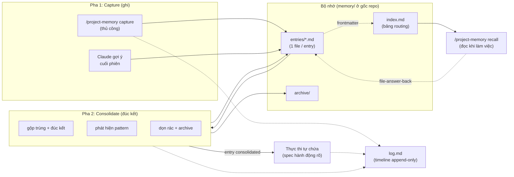
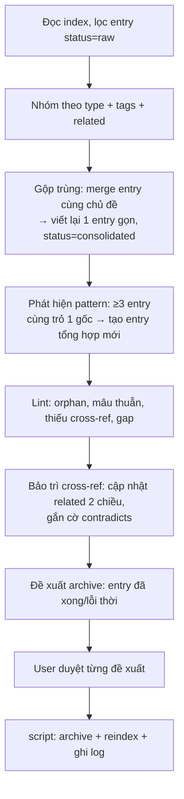

# Thiết kế: `project-memory` — Bộ nhớ tri thức tự cải tiến cấp dự án

- Ngày: 2026-06-05
- Trạng thái: Đã duyệt thiết kế, chờ viết plan
- Skill liên quan đã có: `skill-auto-improver` (cải tiến 1 skill), `skill-creator` (tạo skill)

## 1. Mục tiêu

Xây một skill portable tên `project-memory` đóng vai bộ nhớ tri thức cho dự án đang làm. Nó gom bài học và context rời rạc vào một kho có index routing, đúc kết định kỳ thành tri thức sạch, và làm nền cho việc cải tiến dự án.

Cái lõi: **tách 2 pha rõ ràng**.
- Pha tri thức: capture (ghi) → consolidate (đúc kết).
- Pha thực thi: tách riêng, do người dùng kích hoạt, không bao giờ tự động nối tiếp consolidation.

Một skill điều phối cả vòng đời: ghi → đúc kết → (khi cần) thực thi.

Tham chiếu tư tưởng: pattern này mượn từ "LLM Wiki" (kho tri thức compound do LLM tự bảo trì) nhưng thu hẹp cho domain bộ nhớ cải tiến dự án. Điểm mượn: bookkeeping là phần tốn sức, giao hết cho LLM để kho luôn sống. Khác biệt cố ý: LLM Wiki tích hợp ngay lúc ingest (đụng nhiều trang/nguồn); ta tách **capture rẻ** khỏi **consolidate đắt**, nên phần "integration" của wiki rơi đúng vào pha consolidate (xem mục 6.2), không kéo ngược lên capture.

## 2. Ràng buộc cốt lõi

1. **Skill chạy độc lập.** Không gọi `skill-auto-improver` hay `skill-creator` (máy khác có thể không cài). `project-memory` tự chứa đủ hướng dẫn tối thiểu để thực thi.
2. **Cơ chế portable, dữ liệu theo repo.** Skill nằm trong `skills/project-memory/`, dùng được cho mọi dự án. Dữ liệu memory ghi vào `memory/` ở thư mục gốc của repo đang mở.
3. **Progressive disclosure.** Đọc `index.md` (nhẹ) trước, chỉ load file entry chi tiết khi cần.
4. **Phân biệt Skill (Công cụ) vs Workflow (Bản đồ).** Skill = tool, trả lời "làm việc này thế nào". Workflow = map, trả lời "khi nào dùng tool nào, theo thứ tự ra sao". Schema entry phải phản ánh khác biệt này.
5. **Hành động khó đảo ngược phải có user duyệt.** Merge, archive làm mất/đổi entry gốc, luôn duyệt trước khi script chạy.

## 3. Taxonomy: 3 loại bản chất

Bốn nhóm thông tin cần quản lý quy về 3 loại bản chất:

| Nhóm gốc | Loại bản chất | Prefix ID | Trả lời câu hỏi |
|----------|---------------|-----------|-----------------|
| Skill cần cải tiến | **Tool** (subtype `improve`) | `T-` | Làm việc X thế nào? |
| Skill mới nên tạo | **Tool** (subtype `new`) | `T-` | Làm việc X thế nào? |
| Workflow lặp lại | **Map** | `M-` | Khi nào dùng tool nào, thứ tự ra sao? |
| Context rời rạc | **Fact** | `F-` | Cần nhớ gì khi làm? |

Khác biệt schema mấu chốt: **Map** ghi *trình tự + tool dùng ở mỗi bước*; **Tool** ghi *cách làm + contract*; **Fact** ghi *sự kiện + khi nào liên quan*.

## 4. Kiến trúc



Mọi thao tác lớn (capture, consolidate, execute) đều append một dòng vào `log.md`. `recall` có thể "file-answer-back": tổng hợp xong một câu trả lời thì đề nghị lưu lại thành entry mới, để khám phá tự compound vào kho.

### 4.1. Bố cục thư mục

```
skills/project-memory/
  SKILL.md
  references/
    schemas.md            # schema chi tiết 3 loại entry + index
    consolidation.md      # quy trình consolidate chi tiết
    capture-signals.md    # tín hiệu nhận biết đáng capture
    self-contained-exec.md# checklist tối thiểu cải tiến/tạo skill, không gọi skill ngoài
  scripts/
    new-entry.py
    reindex.py
    archive.py

<project-root>/
  memory/
    index.md              # catalog content-oriented (routing)
    log.md                # timeline chronological, append-only
    entries/
    archive/
```

## 5. Schema dữ liệu

### 5.1. `memory/index.md`

```markdown
# Memory Index — <tên dự án>

## 🔧 Tools (skill cải tiến + skill mới)
| ID | Tiêu đề | Loại | Status | Tags | File |
|----|---------|------|--------|------|------|
| T-001 | style-writer thiếu ví dụ voice | improve | raw | style-writer | [↗](entries/T-001.md) |

## 🗺️ Maps (workflow lặp lại)
| ID | Tiêu đề | Status | Tags | File |
|----|---------|--------|------|------|
| M-001 | Quy trình tạo skill mới end-to-end | raw | skill-dev | [↗](entries/M-001.md) |

## 📌 Facts (context rời rạc)
| ID | Tiêu đề | Status | Tags | File |
|----|---------|--------|------|------|
| F-001 | gws CLI dùng --params JSON | raw | gdrive | [↗](entries/F-001.md) |
```

Index chỉ chứa metadata đủ để route. `status`: `raw` → `consolidated` → `archived`.

### 5.2. Entry — Tool (`T-xxx`)

```markdown
---
id: T-001
type: tool
subtype: improve   # improve | new
status: raw
created: 2026-06-05
source: conversation   # conversation | manual
tags: [style-writer]
related: [T-005, M-002]
---
## Vấn đề / Cơ hội
Tool yếu chỗ nào, hoặc khoảng trống năng lực cần tool mới.
## Bài học gốc
Tình huống thực tế phát sinh insight.
## Contract đề xuất (làm gì, không phải làm sao)
Input / Output / ranh giới của tool.
## Hành động (khi execute)
Bước cụ thể, tự chứa, không gọi skill ngoài.
```

### 5.3. Entry — Map (`M-xxx`)

```markdown
---
id: M-001
type: map
status: raw
created: 2026-06-05
tags: [skill-dev]
related: []
---
## Mục tiêu workflow
Đạt được gì khi chạy hết bản đồ này.
## Trigger
Khi nào kích hoạt workflow này.
## Trình tự (bản đồ)
1. Bước A — dùng tool/skill nào — output gì
2. Bước B — dùng tool/skill nào — output gì
## Cạm bẫy / lưu ý
Chỗ hay sai khi chạy.
```

### 5.4. Entry — Fact (`F-xxx`)

```markdown
---
id: F-001
type: fact
status: raw
created: 2026-06-05
tags: [gdrive]
related: []
---
## Sự kiện / quy tắc
Nội dung fact.
## Khi nào liên quan
Tình huống fact này hữu ích.
## Nguồn
Vì sao ghi lại.
```

### 5.5. Frontmatter mở rộng (tùy chọn, do consolidate bảo trì)

- `contradicts: [id]` — gắn cờ khi entry mâu thuẫn entry khác. Lint phát hiện, consolidate ghi cờ này để không mất dấu.
- `related` được consolidate bảo trì **2 chiều**: nếu A liên quan B thì B cũng có A. Link là công dân hạng nhất.

### 5.6. `memory/log.md` (timeline append-only)

Mỗi dòng một sự kiện, prefix nhất quán để grep được:

```markdown
## [2026-06-05] capture | T-001 style-writer thiếu ví dụ voice
## [2026-06-05] consolidate | gộp T-003+T-007 → T-003, archive 2 entry
## [2026-06-06] execute | T-001 đã cải tiến style-writer
## [2026-06-06] recall | "cách tạo skill" → file-answer-back M-004
```

Lấy 5 sự kiện gần nhất: `grep "^## \[" memory/log.md | tail -5`. Giúp Claude biết "vừa làm gì" để gợi ý cuối phiên chính xác hơn.

## 6. Ba thao tác

### 6.1. capture

Hai ngả, cùng đổ về `memory/entries/`:
- **Thủ công**: gọi `/project-memory capture` hoặc nói "ghi nhớ cái này". Claude hỏi gọn (type? tiêu đề?), đoán type/tags từ ngữ cảnh, chạy `new-entry.py`, điền nội dung, reindex.
- **Gợi ý cuối phiên**: khi task kết thúc, Claude quét hội thoại tìm tín hiệu đáng ghi, liệt kê đề xuất "nên capture X vào nhóm Y", **user duyệt** rồi mới ghi. Không tự ghi lén.

Tín hiệu nhận biết (chi tiết trong `references/capture-signals.md`):
- Gặp gotcha mất thời gian thử sai → **Fact**.
- Làm một trình tự 2+ lần → **Map**.
- Skill có sẵn yếu / thiếu năng lực → **Tool**.

### 6.2. consolidate (chạy thủ công)



**Lint (mượn từ LLM Wiki, làm giàu consolidate)** — health-check kho, chỉ *đề xuất*, không tự sửa cấu trúc:
- **Orphan**: entry không entry nào link tới, và không link ra. Gợi ý gắn cross-ref hoặc archive.
- **Mâu thuẫn**: 2 entry nói ngược nhau → gắn `contradicts`, hỏi user chọn cái đúng.
- **Thiếu cross-ref**: 2 entry cùng tag/chủ đề nhưng chưa link → đề xuất nối.
- **Gap**: khái niệm nhắc nhiều nhưng chưa có entry riêng → đề xuất câu hỏi/entry cần tạo.

Chốt:
- Consolidation **dừng ở tầng tri thức**, không tự thực thi. Output là entry `consolidated` sạch + danh sách pattern + báo cáo lint.
- Mọi thay đổi cấu trúc (merge, archive, sửa cross-ref) **user duyệt trước**. Script chỉ chạy sau khi duyệt.
- Khi gộp, entry gốc **không xóa thẳng** mà chuyển `archive/` (giữ vết).
- Cross-ref bảo trì **2 chiều**: link A→B luôn kèm B→A.

### 6.3. recall (progressive disclosure)

- `/project-memory recall [query]` → đọc **chỉ `index.md`** trước, match theo type/tags/tiêu đề, rồi **chỉ load file entry liên quan**.
- Tự động gợi recall: đầu phiên hoặc khi bắt đầu task khớp tag, Claude chủ động "memory có N entry liên quan, đọc không?".
- **File-answer-back (mượn từ LLM Wiki)**: khi recall tổng hợp ra một câu trả lời có giá trị (vd so sánh, phân tích, một quy trình vừa đúc ra), Claude đề nghị lưu lại thành entry mới (thường là Map hoặc Fact). User duyệt. Nhờ vậy khám phá không trôi vào chat history mà compound vào kho, giống như nguồn được ingest.

## 7. Phân vai LLM vs script

| Việc | Ai làm |
|------|--------|
| Tạo file entry mới, cấp ID tăng dần | script (`new-entry.py`) |
| Regenerate `index.md` từ frontmatter | script (`reindex.py`) |
| Archive entry, đổi status | script (`archive.py`) |
| Append dòng vào `log.md` | script (`log.py`) |
| Gộp trùng, đúc kết, phát hiện pattern | LLM |
| Lint (orphan, mâu thuẫn, gap), bảo trì cross-ref | LLM đề xuất, user duyệt, script ghi |
| Quyết định entry nào nên archive | LLM đề xuất, user duyệt, script thực thi |

Lý do: bảng index dễ lệch nếu sửa tay. Script quét frontmatter rồi dựng lại bảng, luôn đồng bộ. LLM khỏi gõ lại bảng.

Đặc tả script:
- `new-entry.py <type> <subtype>` — tạo file entry skeleton + cấp ID, in path. Append log.
- `reindex.py` — quét `memory/entries/` + `memory/archive/`, dựng lại `index.md`.
- `archive.py <id>` — chuyển entry sang archive, đổi status, gọi reindex. Append log.
- `log.py <op> <summary>` — append một dòng `## [date] <op> | <summary>` vào `log.md`. Dùng chung cho mọi thao tác.

## 8. Thực thi tự chứa (không phụ thuộc skill ngoài)

- Entry **Tool** chứa sẵn **Contract đề xuất** + **Hành động** đủ rõ. Khi execute, Claude đọc entry và làm trực tiếp bằng năng lực chung (sửa SKILL.md, tạo skill theo cấu trúc chuẩn trong CLAUDE.md). `SKILL.md` của `project-memory` nhúng checklist tối thiểu "cách cải tiến/tạo skill" (trong `references/self-contained-exec.md`).
- Entry **Map** chính là playbook tái dùng: gặp lại trigger, Claude đọc Map và chạy theo trình tự. Map tự nó là thực thi.
- Execution là **pha tách riêng**, user kích hoạt (ví dụ `recall T-001` rồi "làm theo entry này"). Consolidation không bao giờ tự nhảy sang execute.

## 9. Ranh giới với skill có sẵn

- `skill-auto-improver`: đi sâu cải tiến *1 skill* theo 11 nguyên lý.
- `project-memory`: đứng *trên*, là bộ nhớ + định tuyến đa nhóm cho cả dự án.

Hai cái bổ sung, không trùng. `project-memory` tự chứa phần execute tối thiểu nên chạy được kể cả khi máy không có `skill-auto-improver`/`skill-creator`.

## 10. Mở rộng tương lai (chưa làm, ghi để khỏi quên)

- **Search engine over wiki** (vd `qmd`, BM25/vector + re-rank, có CLI + MCP). Khi kho vượt scale vừa, index routing không đủ thì thêm. Hiện tại index + grep log là đủ.
- **Raw immutable source layer**: lưu cả conversation/nguồn gốc thành lớp bất biến. Hiện field `source` trỏ nguồn là đủ cho lesson dự án.
- Hai cái trên modular, thêm sau mà không phá schema.

## 11. Hạng mục cho plan triển khai

1. `SKILL.md` — workflow 3 thao tác (capture/consolidate/recall) + lint + file-answer-back + tín hiệu capture + checklist execute tự chứa.
2. `references/schemas.md` (entry + index + log + frontmatter mở rộng), `consolidation.md` (gồm lint + cross-ref), `capture-signals.md`, `self-contained-exec.md`.
3. Scripts: `new-entry.py`, `reindex.py`, `archive.py`, `log.py`.
4. Cập nhật `CLAUDE.md` + `README.md` (thêm skill mới vào danh sách).
