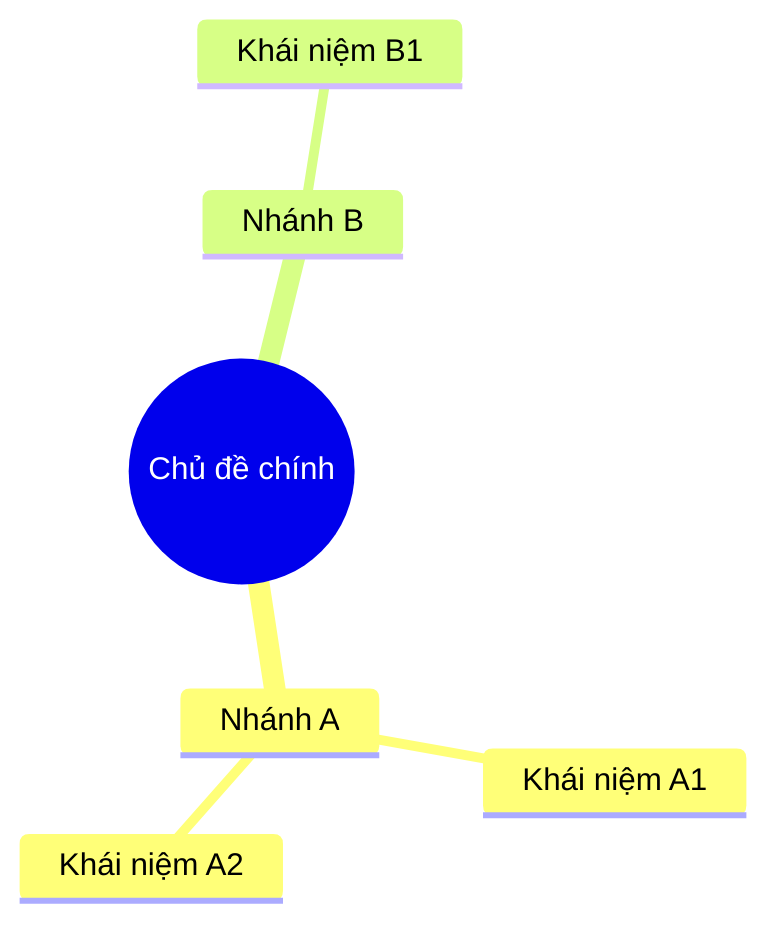

# Deep Reader

Bộ 10 command phân tích nội dung từ nhiều góc nhìn. Mỗi command khai thác nội dung theo cách khác nhau, từ tóm tắt đến phản biện, từ bản đồ khái niệm đến kịch bản video.

## Cách sử dụng

```
/deep-reader <command>
```

User cung cấp nội dung trước (paste text, đính kèm file, gửi URL) rồi gọi command. Hoặc gọi command kèm file path/URL trực tiếp.

Nếu không chỉ định command, hiển thị bảng command bên dưới và hỏi user chọn.

| Command     | Alias   | Mô tả                                   |
| ----------- | ------- | --------------------------------------- |
| `summary`   | `sum`   | Tóm tắt có cấu trúc (Executive Summary) |
| `explain`   | `exp`   | Giải thích theo 3 cấp độ                |
| `insights`  | `ins`   | Trích xuất insight chiến lược           |
| `map`       | —       | Bản đồ khái niệm (Mermaid)              |
| `critique`  | `crit`  | So sánh & phản biện                     |
| `article`   | `art`   | Bài viết chuyên sâu 800–1200 từ         |
| `script`    | `vid`   | Kịch bản video 60–90 giây               |
| `questions` | `q`     | 10 câu hỏi nghiên cứu sâu               |
| `checklist` | `check` | Checklist hành động ưu tiên             |
| `gaps`      | `gap`   | Phát hiện lỗ hổng & mở rộng             |

## Xử lý input

Phát hiện tự động loại input:

1. **Text trong context**: User paste nội dung hoặc có selected text trong IDE. Dùng trực tiếp.
2. **File path**: Phát hiện đường dẫn file (`.pdf`, `.docx`, `.txt`, `.md`, `.epub`). Dùng Read tool để đọc. Với PDF dài (>10 trang), đọc theo từng batch 20 trang.
3. **URL**: Phát hiện URL (http/https). Dùng WebFetch để lấy nội dung.
4. **Nội dung từ turn trước**: Nếu user vừa paste/thảo luận nội dung ở turn trước, dùng nội dung đó.

Nếu không tìm thấy nội dung, hỏi user cung cấp.

Sau khi có nội dung, xác nhận ngắn gọn (1 dòng) nguồn và độ dài đã nhận, rồi thực thi command.

---

## Commands

### 1. summary — Tóm tắt có cấu trúc

Tạo bản Executive Summary cho người bận rộn.

**Output:**

- 5–7 ý chính quan trọng nhất, mỗi ý tối đa 2 câu
- Giữ nguyên số liệu, dẫn chứng, tên riêng quan trọng
- Kết thúc bằng section **"3 Insight nổi bật"** (đánh số, mỗi insight 1–2 câu)

**Nguyên tắc:**

- Ưu tiên thông tin có thể hành động, bỏ phần mô tả chung chung
- Ngôn ngữ trực tiếp, chủ động
- Nếu nội dung nhiều phần/chương: gom theo chủ đề, không theo thứ tự xuất hiện

---

### 2. explain — Giải thích theo cấp độ

Giải thích cùng nội dung cốt lõi theo 3 cấp độ khác nhau.

**Output 3 section:**

**Cấp 1: Beginner (ELI5)**

- Từ đời thường, ví dụ quen thuộc
- Không dùng thuật ngữ chuyên môn
- Như giải thích cho người chưa biết gì về lĩnh vực

**Cấp 2: Intermediate**

- Thêm thuật ngữ cơ bản (giải thích khi dùng lần đầu)
- Nêu mối quan hệ giữa các khái niệm
- Phù hợp người đã biết sơ về lĩnh vực

**Cấp 3: Advanced**

- Phân tích sâu, giữ nguyên thuật ngữ chuyên môn
- Nêu nuance, ngoại lệ, edge case
- Liên hệ framework/lý thuyết liên quan trong lĩnh vực

**Nguyên tắc:** Cả 3 cấp cover cùng nội dung cốt lõi. Mỗi cấp sâu hơn cấp trước, không chỉ dài hơn.

---

### 3. insights — Trích xuất insight chiến lược

Tìm insight có giá trị cao, ưu tiên insight có thể hành động.

**Output:** 5 insight, đánh số. Mỗi insight gồm:

- **Insight**: Phát biểu ngắn gọn (1 câu)
- **Vì sao quan trọng**: Giải thích tác động (1–2 câu)
- **Áp dụng**: Cách dùng trong thực tế — business, content, marketing, hoặc lĩnh vực phù hợp với nội dung (1–2 câu)

**Nguyên tắc:**

- Insight là điều ẩn sau bề mặt, không phải tóm tắt lại nội dung
- Ưu tiên insight phản trực giác hoặc ít người nhận ra
- Mỗi insight độc lập, không trùng lặp

---

### 4. map — Bản đồ khái niệm

Tạo sơ đồ Mermaid thể hiện mối quan hệ giữa các khái niệm chính.

**Output:**

- Code block Mermaid hợp lệ
- Giải thích ngắn (3–5 dòng) về cấu trúc và cách đọc sơ đồ

**Chọn loại sơ đồ phù hợp nội dung:**

- `mindmap`: Nội dung phân cấp, từ chủ đề chính tỏa nhánh
- `flowchart LR` hoặc `flowchart TD`: Nội dung có quy trình, nhân quả, luồng logic
- `graph`: Nội dung có nhiều quan hệ chéo giữa khái niệm

**Nguyên tắc:**

- Tối đa 15–20 node. Nhiều hơn thì gom nhóm
- Label node ngắn gọn (2–5 từ)
- Thể hiện quan hệ bằng text trên arrow khi cần thiết
- Ví dụ mindmap:



---

### 5. critique — So sánh & phản biện

Phân tích quan điểm trong nội dung theo hướng phản biện.

**Output:** Với mỗi quan điểm chính trong tài liệu:

- **Điểm mạnh**: Luận điểm/bằng chứng thuyết phục
- **Điểm yếu**: Giả định chưa rõ, thiếu sót logic, bằng chứng yếu
- **Góc nhìn đối lập**: Quan điểm trái ngược có cơ sở

Kết thúc: **Kết luận** — Quan điểm nào đáng tin cậy nhất và vì sao (2–3 câu).

**Nguyên tắc:**

- Công bằng, không thiên vị quan điểm nào
- Phân biệt rõ sự kiện vs. ý kiến
- Chỉ ra giả định ngầm mà tác giả không nêu rõ

---

### 6. article — Bài viết chuyên sâu

Viết bài chuyên sâu 800–1200 từ dựa trên nội dung gốc.

**Output:**

- **Tiêu đề**: Hấp dẫn, cụ thể, gợi giá trị cho người đọc
- **Mở bài**: Hook gây tò mò hoặc nêu vấn đề (2–3 câu)
- **Thân bài**: 3–5 phần, mỗi phần có heading. Giữ insight quan trọng từ tài liệu gốc
- **Kết luận**: Đúc kết, mở rộng, hoặc kêu gọi hành động

**Nguyên tắc:**

- Văn phong dễ hiểu, có chiều sâu, không hàn lâm
- Mỗi đoạn mở bằng câu chủ đề
- Giữ nguyên số liệu, dẫn chứng quan trọng từ nguồn gốc

---

### 7. script — Kịch bản video ngắn

Kịch bản video 60–90 giây, phù hợp TikTok, Reels, Shorts.

**Output format:**

```
[HOOK — 3 giây]
Câu mở đầu gây tò mò, đặt vấn đề sốc/bất ngờ

[PHẦN 1 — 15–20 giây]
Ý chính #1

[PHẦN 2 — 15–20 giây]
Ý chính #2

[PHẦN 3 — 15–20 giây]
Ý chính #3 hoặc twist/insight bất ngờ

[CTA — 5–10 giây]
Kêu gọi hành động: follow, comment, share
```

**Nguyên tắc:**

- Hook PHẢI gây tò mò trong 3 giây đầu: câu hỏi, số liệu sốc, tuyên bố ngược
- Mỗi phần ngắn, 1 ý duy nhất
- Ngôn ngữ nói, tự nhiên, không văn viết
- Ghi chú visual/hành động trong ngoặc đơn khi phù hợp

---

### 8. questions — Câu hỏi nghiên cứu sâu

10 câu hỏi giúp đào sâu và mở rộng vấn đề.

**Output chia 3 mức:**

**Cơ bản (3–4 câu):** Hiểu rõ khái niệm cốt lõi

**Trung bình (3–4 câu):** Phân tích, so sánh, tìm mối quan hệ

**Nâng cao (2–3 câu):** Thách thức giả định, mở rộng sang lĩnh vực liên quan, đề xuất nghiên cứu mới

**Nguyên tắc:**

- Câu hỏi mở, dẫn đến tìm hiểu tiếp. Không hỏi có/không
- Ưu tiên "tại sao" và "nếu... thì..." hơn "là gì"
- Câu hỏi nâng cao có tiềm năng dẫn đến nghiên cứu độc lập

---

### 9. checklist — Checklist hành động

Checklist áp dụng ngay từ nội dung.

**Output:**

- Dạng `- [ ]` (checkbox markdown)
- Sắp xếp theo thứ tự ưu tiên (quan trọng nhất trước)
- Mỗi item: hành động cụ thể, bắt đầu bằng động từ
- Gom nhóm nếu nhiều hơn 10 item

**Nguyên tắc:**

- Mỗi item đủ cụ thể để thực hiện mà không cần tra cứu thêm
- Bỏ bước hiển nhiên
- Nếu item cần điều kiện tiên quyết, ghi chú ngắn trong ngoặc

---

### 10. gaps — Phát hiện lỗ hổng & mở rộng

Phân tích điểm thiếu và đề xuất hướng mở rộng.

**Output 2 phần:**

**Phần 1: Lỗ hổng**

- Điểm còn thiếu trong nội dung
- Giả định chưa được chứng minh
- Vấn đề chưa đề cập nhưng liên quan trực tiếp
- Dữ liệu/bằng chứng bị bỏ qua

**Phần 2: Mở rộng**

- 3–5 hướng nghiên cứu tiếp theo (đánh số, mỗi hướng 1–2 câu)
- Gợi ý tài liệu, chủ đề, hoặc từ khóa nên tìm hiểu thêm

**Nguyên tắc:**

- Phân biệt rõ thiếu sót (đáng lẽ phải có) vs. ngoài phạm vi
- Tập trung điểm cụ thể có thể cải thiện, không phê phán chất lượng chung

---

## Quy tắc output chung

- Output bằng tiếng Việt. Thuật ngữ chuyên môn giữ nguyên tiếng Anh.
- Mỗi command tạo output độc lập, đọc riêng không cần context từ command khác.
- Dùng heading, list, bảng khi phù hợp. Câu ngắn, chủ động.
- Nội dung gốc tiếng Anh: phân tích bằng tiếng Việt, trích dẫn gốc khi cần.
- Nội dung dài (>5000 từ): tập trung vào phần quan trọng nhất, ghi chú phần nào đã bỏ qua.
