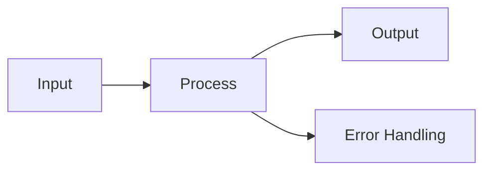
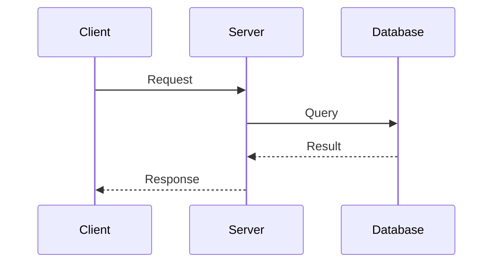

# Slidev Slide Templates

Mẫu Slidev Markdown cho từng slide type. `slidev` skill PHẢI follow patterns này khi generate `slides.md`. Thay thế nội dung placeholder bằng content thực tế từ outline.

**Quy tắc chung:**

* Mỗi slide bắt đầu bằng `---` separator (trừ slide đầu tiên dùng headmatter)

* Layout được chỉ định qua YAML front matter mỗi slide

* Speaker notes dùng HTML comment `<!-- notes -->`

* Code blocks dùng native Markdown fenced blocks (triple backtick)

* KHÔNG dùng image, chỉ text-only

## title → cover

```md
---
layout: cover
---

# {Title Text}

{Subtitle Text}

<!--
Speaker notes here
-->
```

Cover slide chứa inline code (backtick):

```md
---
layout: cover
---

# Giới thiệu `React` Hooks

Hiểu cách dùng `useState` và `useEffect`

<style>
code {
  color: #e2e8f0 !important;
  background: rgba(255,255,255,0.15) !important;
}
</style>

<!--
Speaker notes here
-->
```

## agenda → default

```md
---
layout: default
---

# {Agenda Title}

1. **01** — Section name
2. **02** — Section name
3. **03** — Section name

<!--
Speaker notes here
-->
```

## content → default

```md
---
layout: default
---

# {Assertion Title}

- Bullet point text
- **Label:** detail text
- Another point

<!--
Speaker notes here
-->
```

Content slide với sub-bullets (L2/L3):

```md
---
layout: default
---

# {Assertion Title}

- Main bullet 1
  - Sub-detail hoặc ví dụ
- **Label:** detail text
  - Sub-detail
- Another point

<!--
Speaker notes here
-->
```

## comparison → two-cols-header

```md
---
layout: two-cols-header
---

# {Comparison Title}

::left::

### {Left Header}

- Point A
- Point B

::right::

### {Right Header}

- Point A
- Point B

<!--
Speaker notes here
-->
```

## summary → default

```md
---
layout: default
---

# Key Takeaways

- ✅ Takeaway point 1
- ✅ Takeaway point 2
- ✅ Takeaway point 3

<!--
Speaker notes here
-->
```

## cta → end

```md
---
layout: end
---

# {CTA Message}

{Supporting detail / contact info}

<!--
Speaker notes here
-->
```

End slide chứa inline code:

```md
---
layout: end
---

# Bắt đầu với `pnpm create slidev`

Tham khảo docs tại `sli.dev`

<style>
code {
  color: #e2e8f0 !important;
  background: rgba(255,255,255,0.15) !important;
}
</style>

<!--
Speaker notes here
-->
```

## transition → section

```md
---
layout: section
---

# {Section Title}

Part X of Y

<!--
Speaker notes here
-->
```

## statement → statement

```md
---
layout: statement
---

# {Bold assertion or key insight}

{Optional source or context}

<!--
Speaker notes here
-->
```

## metric → fact

```md
---
layout: fact
---

# {85%}

{Metric Label}

{Brief context or comparison}

<!--
Speaker notes here
-->
```

## quote → quote

```md
---
layout: quote
---

# "{Quote text here}"

— {Author Name}, {Title/Source}

<!--
Speaker notes here
-->
```

Quote với context bổ sung:

```md
---
layout: quote
---

# "Data is the new oil, but only if you know how to refine it."

— Clive Humby, Mathematician

Dữ liệu thô vô giá trị nếu không có phân tích

<!--
Speaker notes here
-->
```

## table → default

Bảng so sánh dữ liệu có cấu trúc:

```md
---
layout: default
---

# {Table Slide Title}

| {Col 1 Header} | {Col 2 Header} | {Col 3 Header} |
|-----------------|-----------------|-----------------|
| Data A1         | Data A2         | Data A3         |
| Data B1         | Data B2         | Data B3         |
| Data C1         | Data C2         | Data C3         |

<!--
Speaker notes here
-->
```

**Lưu ý tables:**

* Max 5-6 rows, 3-4 columns per slide (readability)

* Dùng **bold** cho cells cần nhấn mạnh: `| **95%** | 72% | 61% |`

* Nếu data nhiều hơn → tách thành multiple slides hoặc chuyển sang comparison layout

## diagram → default (Mermaid)

Flowchart cơ bản:

````md
---
layout: default
---

# {Diagram Slide Title}



<!--
Speaker notes here
-->
````

Sequence diagram:

````md
---
layout: default
---

# {Sequence Diagram Title}



<!--
Speaker notes here
-->
````

**Lưu ý Mermaid:**

* Built-in trong Slidev, không cần plugin

* Inline options: `` ```mermaid {theme: 'forest', scale: 0.8} ``

* Phù hợp nhất cho Technical/Process content type

* Giữ diagram đơn giản: max 8-10 nodes/actors per slide

* Mermaid KHÔNG dùng image — phù hợp text-only constraint

## comparison-simple → two-cols

Two columns không header (so sánh đơn giản):

```md
---
layout: two-cols
---

### {Left Header}

- Point A
- Point B
- Point C

::right::

### {Right Header}

- Point A
- Point B
- Point C

<!--
Speaker notes here
-->
```

**Khi nào dùng `two-cols` vs `two-cols-header`:**

* `two-cols`: Khi không cần title spanning cả 2 columns (VD: Before/After, Option A/B đơn giản)

* `two-cols-header`: Khi cần title chung phía trên (VD: "So sánh Framework X vs Y")

## code → default

Basic code block:

```md
---
layout: default
---

# {Code Slide Title}

\`\`\`python
def example():
    return "Hello World"
\`\`\`

- Key point about the code

<!--
Speaker notes here
-->
```

Với line highlighting (highlight dòng cụ thể):

```md
---
layout: default
---

# {Code Slide Title}

\`\`\`python {3,4}
def process_data(items):
    results = []
    for item in items:        # highlighted
        results.append(item)  # highlighted
    return results
\`\`\`

- Dòng 3-4: vòng lặp xử lý chính

<!--
Speaker notes here
-->
```

Với click-based highlighting (highlight từng phần khi click):

```md
---
layout: default
---

# {Code Slide Title}

\`\`\`python {1|3-4|6|all}
def process_data(items):
    results = []
    for item in items:
        results.append(item)
    return results
\`\`\`

<!--
Click 1: highlight dòng 1 (function signature)
Click 2: highlight dòng 3-4 (loop logic)
Click 3: highlight dòng 6 (return)
Click 4: highlight all
-->
```

**Lưu ý code blocks:**

* Dùng ngôn ngữ cụ thể sau triple backtick (python, javascript, bash, etc.) để có syntax highlighting tự động

* Max 10-15 dòng code/slide

* **Line highlighting** `{2,3}`: highlight cố định — dùng khi muốn nhấn mạnh dòng quan trọng ngay lập tức

* **Click-based highlighting** `{1|3-4|all}`: highlight theo click — dùng khi muốn giải thích code từng phần, phù hợp cho walkthrough/tutorial

* Ưu tiên click-based highlighting cho L2/L3 technical presentations để tạo progressive disclosure

## Advanced Features

### v-click — Progressive Disclosure

`v-click` directive cho phép hiện nội dung từng bước khi click. Đây là feature quan trọng nhất cho presentations — tránh audience đọc hết slide trước khi presenter giải thích.

**Bullet list reveal (dùng cho mọi content slide L2/L3):**

```md
---
layout: default
---

# {Assertion Title}

<v-click>

- First point revealed on click 1

</v-click>
<v-click>

- Second point revealed on click 2

</v-click>
<v-click>

- Third point revealed on click 3

</v-click>

<!--
Speaker notes here
-->
```

**Compact syntax với v-clicks wrapper (recommended cho bullet lists):**

```md
---
layout: default
---

# {Assertion Title}

<v-clicks>

- Point 1 — revealed sequentially
- Point 2 — on next click
- Point 3 — on next click

</v-clicks>

<!--
Speaker notes here
-->
```

**Two-column progressive reveal:**

```md
---
layout: two-cols-header
---

# {Comparison Title}

::left::

### Before

<v-clicks>

- Old approach A
- Old approach B
- Old approach C

</v-clicks>

::right::

### After

<v-clicks>

- New approach A
- New approach B
- New approach C

</v-clicks>

<!--
Speaker notes here
-->
```

**Khi nào dùng v-click:**

* **L1**: KHÔNG dùng — slides đã ngắn, thêm clicks gây chậm
* **L2**: Dùng cho content slides có ≥3 bullets — reveal từng point
* **L3**: Dùng cho tất cả content slides — progressive disclosure giúp audience theo kịp
* **Comparison slides**: Luôn dùng — reveal từng cột lần lượt
* **Summary slides**: Dùng — reveal từng takeaway

### Slide Transitions

Per-slide transition effects. Cấu hình trong frontmatter:

```md
---
layout: default
transition: slide-left
---

# Slide với transition

Content here
```

**Built-in transitions:**

| Transition | Hiệu ứng |
|------------|-----------|
| `fade` | Fade in/out |
| `fade-out` | Fade out rồi hiện slide mới |
| `slide-left` | Trượt từ phải sang trái |
| `slide-right` | Trượt từ trái sang phải |
| `slide-up` | Trượt từ dưới lên |
| `slide-down` | Trượt từ trên xuống |

**Global transition (đặt trong headmatter slide đầu tiên):**

```yaml
---
transition: fade
---
```

**Khi nào dùng transitions:**

* Transition slides (section dividers): `slide-left` hoặc `fade`
* Statement/metric slides: `fade` tạo dramatic effect
* Không nên dùng transition khác nhau cho mỗi slide — chọn 1 global transition, override chỉ khi cần nhấn mạnh

### v-mark — Text Emphasis (Rough Notation)

Hand-drawn highlight overlays cho text. Tạo visual emphasis tự nhiên.

```md
---
layout: default
---

# {Slide Title}

- Regular point here
- <span v-mark.highlight="1">Key insight highlighted on click</span>
- Another point with <span v-mark.underline="2">underlined emphasis</span>

<!--
Speaker notes here
-->
```

**Markup types:**

| Type | Cú pháp | Hiệu ứng |
|------|---------|-----------|
| Highlight | `v-mark.highlight` | Nền vàng hand-drawn |
| Underline | `v-mark.underline` | Gạch chân hand-drawn |
| Circle | `v-mark.circle` | Khoanh tròn |
| Strike | `v-mark.strike` | Gạch ngang |
| Box | `v-mark.box` | Hộp bao quanh |

**Khi nào dùng v-mark:**

* Statement slides — highlight từ khóa chính
* Content slides — nhấn mạnh data point quan trọng trong bullet
* Không nên overuse — max 1-2 v-mark per slide

### Shiki Magic Move — Code Morphing (L2/L3)

Smooth animation biến đổi giữa các code blocks. Dùng cho technical walkthrough — show code evolving step by step.

````md
---
layout: default
---

# {Code Evolution Title}

````magic-move
```python
# Step 1: Basic function
def greet():
    print("Hello")
```

```python
# Step 2: Add parameter
def greet(name):
    print(f"Hello, {name}")
```

```python
# Step 3: Add return value
def greet(name):
    message = f"Hello, {name}"
    return message
```
````

<!--
Click qua từng step để thấy code morph tự nhiên
-->
````

**Lưu ý Magic Move:**

* Chỉ dùng cho L2/L3 technical presentations
* Max 3-4 steps per Magic Move (tránh quá dài)
* Mỗi step nên thay đổi ít (1-3 dòng) để audience dễ theo dõi
* Dùng comments trong code để label mỗi step

