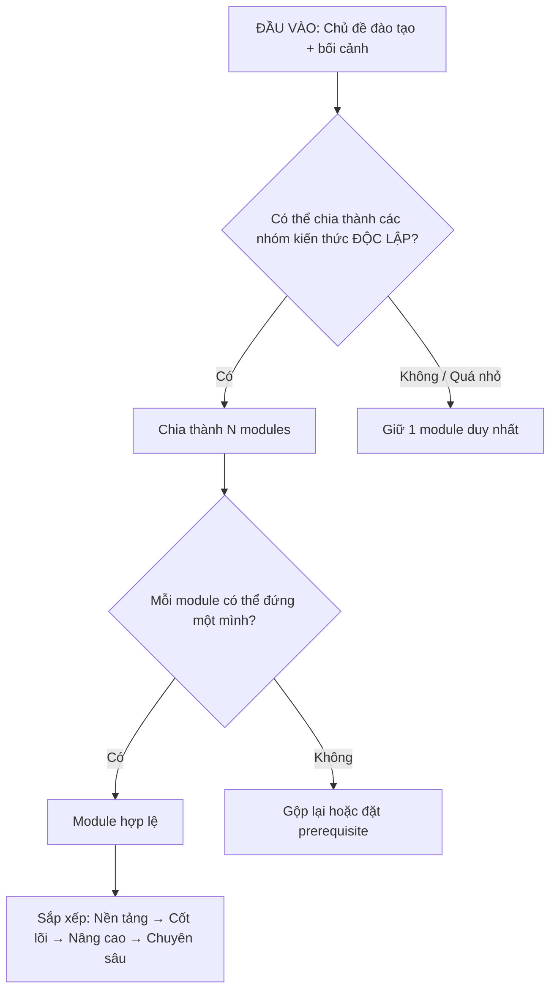
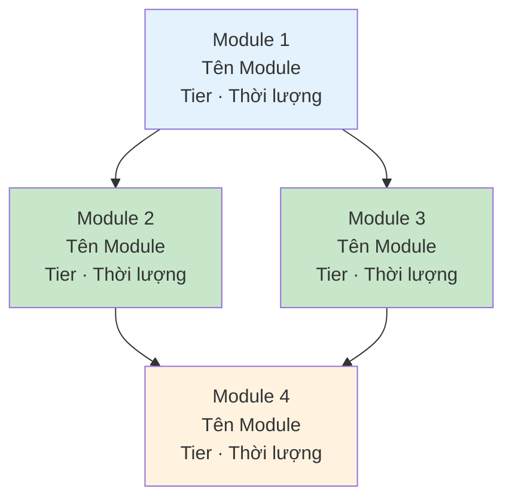

# Kiến Trúc Modular

## 1. Tại Sao Chia Module?

```
📁 Feedback_Training/
├── Module 1: Nền tảng Feedback    → VĂN-TƯ-TU riêng
├── Module 2: Kỹ thuật SBI         → VĂN-TƯ-TU riêng
├── Module 3: Nhận Feedback         → VĂN-TƯ-TU riêng
└── Module 4: Follow-up & Đo lường → VĂN-TƯ-TU riêng
```

Linh hoạt:  
• Team A (mới): Học cả 4 module theo thứ tự  
• Team B (có nền): Bỏ Module 1, bắt đầu từ Module 2  
• Team C (remote): Thêm Module 5: Feedback trong môi trường Remote  
• Cá nhân: Chỉ cần Module 2 (SBI) → lấy ra dùng ngay

## 2. Nguyên Tắc Phân Tách Module

**5 quy tắc phân tách:**

| #   | Quy tắc                           | Giải thích                                                                   | Ví dụ                                               |
| --- | --------------------------------- | ---------------------------------------------------------------------------- | --------------------------------------------------- |
| 1   | **1 module = 1 chủ đề trọng tâm** | Người học nắm rõ "module này dạy cái gì" trong 1 câu                         | "Module này dạy kỹ thuật SBI"                       |
| 2   | **Độc lập tối đa**                | Bỏ module A, module B vẫn hoạt động. Nếu B phụ thuộc A → ghi rõ prerequisite | Module "SBI" không phụ thuộc module "Nhận Feedback" |
| 3   | **Đủ nhỏ để hoàn thành**          | 1 module = 1-5 ngày (cá nhân) hoặc 1-2 tuần (team)                           | Không nên 1 module kéo dài 3 tháng                  |
| 4   | **Đủ lớn để có giá trị**          | Học xong module → làm được ít nhất 1 việc cụ thể                             | Không tách "Định nghĩa Feedback" thành module riêng |
| 5   | **Cùng cấp độ trừu tượng**        | Không trộn module nền tảng với module chuyên sâu trong cùng tier             | Nền tảng AI ≠ Fine-tuning LLM                       |


**Quy trình phân tách:**



## 3. Phân Loại Module Theo Tier

```
TIER 1: NỀN TẢNG (Foundation)
• Kiến thức cơ bản ai cũng cần
• Prerequisite cho các tier sau
• Ví dụ: "Feedback là gì?", "AI cơ bản"

         ↓ (prerequisite)

TIER 2: CỐT LÕI (Core)
• Kỹ năng chính của khoá đào tạo
• Chiếm phần lớn thời lượng
• Ví dụ: "Kỹ thuật SBI", "Prompt Engineering"

         ↓ (tuỳ chọn)

TIER 3: NÂNG CAO (Advanced)
• Mở rộng, đào sâu
• Cho người học nhanh hoặc có nhu cầu
• Ví dụ: "Feedback văn hoá đa quốc gia", "Agent Architecture"

         ↓ (tuỳ chọn)

TIER 4: CHUYÊN SÂU (Specialized)
• Theo ngành/domain cụ thể
• Chỉ áp dụng cho nhóm nhỏ
• Ví dụ: "Feedback cho team Sales", "MCP Server Development"
```

**Quy tắc ghép module theo đối tượng:**

| Đối tượng           | Tier 1            | Tier 2   | Tier 3   | Tier 4   |
| ------------------- | ----------------- | -------- | -------- | -------- |
| Người mới hoàn toàn | Bắt buộc          | Bắt buộc | Chưa cần | Không    |
| Có nền tảng         | Bỏ qua / ôn nhanh | Bắt buộc | Tuỳ chọn | Không    |
| Tiềm năng cao       | Bỏ qua            | Rút gọn  | Bắt buộc | Tuỳ chọn |
| Expert / Chuyên gia | Bỏ qua            | Bỏ qua   | Bắt buộc | Bắt buộc |


## 4. Cấu Trúc Folder Chuẩn — Multi-Module

```
📁 [TÊN_KHOÁ]_Training/
│
├── 📄 00_TỔNG_QUAN.md
│   (Mục tiêu khoá, danh sách modules, lộ trình, prerequisite map)
│
├── 📁 Module_01_[Tên_Module]/
│   ├── 📄 README.md                  ← Mục tiêu module, prerequisite, thời lượng
│   ├── 📁 VAN/
│   │   ├── 📄 core_reading.md        ← Kiến thức chính (≤10 trang)
│   │   ├── 📄 tom_tat.md             ← Tóm tắt 1 trang
│   │   └── 📄 knowledge_check.md     ← Quiz 5-10 câu
│   ├── 📁 TU_SUY_TU/
│   │   ├── 📄 cau_hoi_phan_chieu.md  ← 5-7 câu hỏi mở
│   │   ├── 📄 case_study.md          ← Tình huống + phân tích
│   │   └── 📄 nhat_ky_phan_tu.md     ← Template nhật ký
│   ├── 📁 TU_THUC_HANH/
│   │   ├── 📄 guided_practice.md     ← Bài thực hành có hướng dẫn
│   │   ├── 📄 du_an_thuc_te.md       ← Brief dự án áp dụng
│   │   └── 📄 checklist_hanh_dong.md ← Checklist hàng ngày
│   └── 📁 DANH_GIA/
│       ├── 📄 rubric.md              ← Tiêu chí đánh giá
│       └── 📄 after_action_review.md ← Template đúc kết
│
├── 📁 Module_02_[Tên_Module]/
│   └── (cùng cấu trúc)
│
├── 📁 _Facilitator_Hub/
│   ├── 📄 huong_dan_chung.md         ← Hướng dẫn facilitation cho khoá
│   ├── 📄 module_map.md              ← Sơ đồ prerequisite giữa modules
│   └── 📄 lich_trinh_goi_y.md        ← Gợi ý lịch trình theo quy mô
│
└── 📁 _Danh_Gia_Khoa/
    ├── 📄 survey_cuoi_khoa.md
    └── 📄 follow_up_30_60_90.md
```

## 5. Module README — Tấm Thẻ Căn Cước Của Module

Mỗi module BẮT BUỘC có README.md:

```markdown
# Module [N]: [Tên Module]

## Thông tin module
| Thuộc tính | Giá trị |
|-----------|---------|
| **Tier** | [Foundation / Core / Advanced / Specialized] |
| **Thời lượng** | [X giờ (cá nhân) / Y tuần (team)] |
| **Prerequisite** | [Không / Module N: tên] |
| **Mục tiêu** | Sau module này, người học có thể: |
|  | 1. [Hành vi cụ thể, đo lường được] |
|  | 2. [Hành vi cụ thể, đo lường được] |

## Tỷ lệ Văn-Tư-Tu
| Văn | Tư | Tu |
|-----|-----|-----|
| [X]% | [Y]% | [Z]% |

## Phân bổ thời gian
| Thành phần | Thời lượng | Hoạt động chính |
|-----------|-----------|----------------|
| VĂN | [X] | [Mô tả ngắn] |
| TƯ  | [Y] | [Mô tả ngắn] |
| TU  | [Z] | [Mô tả ngắn] |

## Kết nối với module khác
- **Trước module này:** [Module nào cần học trước, nếu có]
- **Sau module này:** [Module nào nên học tiếp]
- **Có thể học song song:** [Module nào không phụ thuộc]
```

## 6. Prerequisite Map

Luôn vẽ prerequisite map bằng Mermaid:



Quy tắc màu:

- Foundation: `fill:#E3F2FD` (xanh nhạt)
- Core: `fill:#C8E6C9` (xanh lá nhạt)
- Advanced: `fill:#FFF3E0` (cam nhạt)
- Specialized: `fill:#F3E5F5` (tím nhạt)
