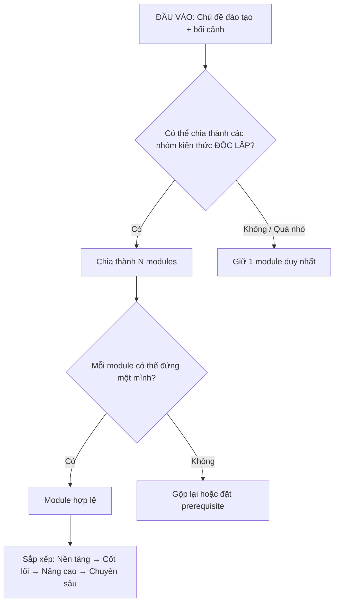
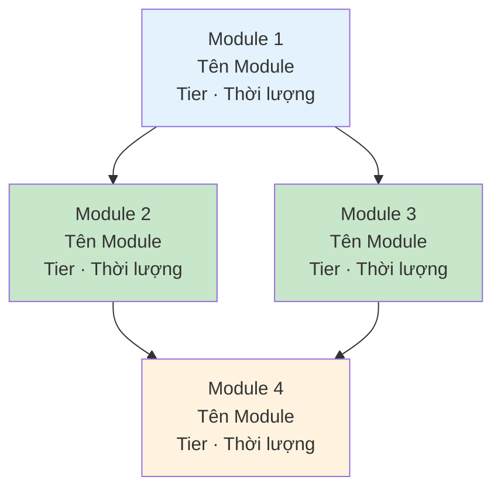

# Kiến Trúc Modular

> Mọi tên folder và file trong file này tuân thủ chuẩn trong [naming-convention.md](naming-convention.md). Đọc file đó trước khi tạo cấu trúc thực tế.

## 1. Tại Sao Chia Module?

```
khoa-feedback-training/
├── module-01-nen-tang-feedback/   → VĂN-TƯ-TU riêng
├── module-02-ky-thuat-sbi/        → VĂN-TƯ-TU riêng
├── module-03-nhan-feedback/       → VĂN-TƯ-TU riêng
└── module-04-follow-up-do-luong/  → VĂN-TƯ-TU riêng
```

Linh hoạt:  
• Team A (mới): Học cả 4 module theo thứ tự  
• Team B (có nền): Bỏ Module 1, bắt đầu từ Module 2  
• Team C (remote): Thêm Module 5: Feedback trong môi trường Remote  
• Cá nhân: Chỉ cần Module 2 (SBI) → lấy ra dùng ngay

## 2. Nguyên Tắc Phân Tách Module

**5 quy tắc phân tách:**

| #   | Quy tắc                           | Giải thích                                                                   | Ví dụ                                               |
| --- | --------------------------------- | ---------------------------------------------------------------------------- | --------------------------------------------------- |
| 1   | **1 module = 1 chủ đề trọng tâm** | Người học nắm rõ "module này dạy cái gì" trong 1 câu                         | "Module này dạy kỹ thuật SBI"                       |
| 2   | **Độc lập tối đa**                | Bỏ module A, module B vẫn hoạt động. Nếu B phụ thuộc A → ghi rõ prerequisite | Module "SBI" không phụ thuộc module "Nhận Feedback" |
| 3   | **Đủ nhỏ để hoàn thành**          | 1 module = 1-5 ngày (cá nhân) hoặc 1-2 tuần (team)                           | Không nên 1 module kéo dài 3 tháng                  |
| 4   | **Đủ lớn để có giá trị**          | Học xong module → làm được ít nhất 1 việc cụ thể                             | Không tách "Định nghĩa Feedback" thành module riêng |
| 5   | **Cùng cấp độ trừu tượng**        | Không trộn module nền tảng với module chuyên sâu trong cùng tier             | Nền tảng AI ≠ Fine-tuning LLM                       |


**Quy trình phân tách:**



## 3. Phân Loại Module Theo Tier

```
TIER 1: NỀN TẢNG (Foundation)
• Kiến thức cơ bản ai cũng cần
• Prerequisite cho các tier sau
• Ví dụ: "Feedback là gì?", "AI cơ bản"

         ↓ (prerequisite)

TIER 2: CỐT LÕI (Core)
• Kỹ năng chính của khoá đào tạo
• Chiếm phần lớn thời lượng
• Ví dụ: "Kỹ thuật SBI", "Prompt Engineering"

         ↓ (tuỳ chọn)

TIER 3: NÂNG CAO (Advanced)
• Mở rộng, đào sâu
• Cho người học nhanh hoặc có nhu cầu
• Ví dụ: "Feedback văn hoá đa quốc gia", "Agent Architecture"

         ↓ (tuỳ chọn)

TIER 4: CHUYÊN SÂU (Specialized)
• Theo ngành/domain cụ thể
• Chỉ áp dụng cho nhóm nhỏ
• Ví dụ: "Feedback cho team Sales", "MCP Server Development"
```

**Quy tắc ghép module theo đối tượng:**

| Đối tượng           | Tier 1            | Tier 2   | Tier 3   | Tier 4   |
| ------------------- | ----------------- | -------- | -------- | -------- |
| Người mới hoàn toàn | Bắt buộc          | Bắt buộc | Chưa cần | Không    |
| Có nền tảng         | Bỏ qua / ôn nhanh | Bắt buộc | Tuỳ chọn | Không    |
| Tiềm năng cao       | Bỏ qua            | Rút gọn  | Bắt buộc | Tuỳ chọn |
| Expert / Chuyên gia | Bỏ qua            | Bỏ qua   | Bắt buộc | Bắt buộc |


## 4. Cấu Trúc Folder Chuẩn — Multi-Module

> Tên folder/file dưới đây tuân thủ tuyệt đối [naming-convention.md](naming-convention.md): kebab-case, tiếng Việt không dấu, zero-pad 2 chữ số, prefix `_` cho folder meta.

```
<slug-khoa>-training/
│
├── 00-tong-quan.md
│   (Mục tiêu khoá, danh sách modules, lộ trình, prerequisite map)
│
├── module-01-<slug-chu-de>/
│   ├── README.md                        ← Thẻ căn cước module
│   ├── 01-van/
│   │   ├── tai-lieu-chinh.md            ← Kiến thức chính (≤10 trang)
│   │   ├── tom-tat.md                   ← Tóm tắt 1 trang
│   │   └── kiem-tra-kien-thuc.md        ← Quiz 5-10 câu
│   ├── 02-tu-suy-tu/
│   │   ├── cau-hoi-phan-chieu.md        ← 5-7 câu hỏi mở
│   │   ├── tinh-huong.md                ← Case study + phân tích
│   │   └── nhat-ky-phan-tu.md           ← Template nhật ký
│   ├── 03-tu-thuc-hanh/
│   │   ├── bai-thuc-hanh-co-huong-dan.md ← Guided practice
│   │   ├── du-an-thuc-te.md             ← Brief dự án áp dụng
│   │   └── checklist-hanh-dong.md       ← Checklist hàng ngày
│   └── 04-danh-gia/
│       ├── rubric.md                    ← Tiêu chí đánh giá
│       └── aar.md                       ← Template After-Action Review
│
├── module-02-<slug-chu-de>/
│   └── (cùng cấu trúc)
│
├── _facilitator-hub/
│   ├── huong-dan-chung.md               ← Hướng dẫn facilitation cho khoá
│   ├── so-do-module.md                  ← Prerequisite map (Mermaid + click link)
│   └── lich-trinh-goi-y.md              ← Gợi ý lịch trình theo quy mô
│
└── _danh-gia-khoa/
    ├── survey-cuoi-khoa.md
    └── follow-up-30-60-90.md
```

**Lưu ý:** Không đổi tên 4 phase folder (`01-van`, `02-tu-suy-tu`, `03-tu-thuc-hanh`, `04-danh-gia`) dù module chọn chiều kiến tạo (Tu→Tư→Văn). Thứ tự học do README module quy định — folder chỉ phản ánh cấu trúc nội dung.

## 5. Module README — Tấm Thẻ Căn Cước Của Module

Mỗi module BẮT BUỘC có `README.md`. Mục **Điều hướng** là bắt buộc theo [naming-convention.md § 3.3](naming-convention.md#33-bản-đồ-link-bắt-buộc) — mọi link là relative path markdown.

```markdown
# Module [N]: [Tên Module]

[← Tổng quan khoá](../00-tong-quan.md)

## Thông tin module
| Thuộc tính | Giá trị |
|-----------|---------|
| **Tier** | [Foundation / Core / Advanced / Specialized] |
| **Thời lượng** | [X giờ (cá nhân) / Y tuần (team)] |
| **Prerequisite** | [Không / [Module N: tên](../module-0N-slug/README.md)] |
| **Mục tiêu** | Sau module này, người học có thể: |
|  | 1. [Hành vi cụ thể, đo lường được] |
|  | 2. [Hành vi cụ thể, đo lường được] |

## Tỷ lệ Văn-Tư-Tu
| Văn | Tư | Tu |
|-----|-----|-----|
| [X]% | [Y]% | [Z]% |

## Phân bổ thời gian
| Thành phần | Thời lượng | Hoạt động chính |
|-----------|-----------|----------------|
| VĂN | [X] | [Mô tả ngắn] |
| TƯ  | [Y] | [Mô tả ngắn] |
| TU  | [Z] | [Mô tả ngắn] |

## Điều hướng nội dung module
- **Văn:** [Tài liệu chính](01-van/tai-lieu-chinh.md) · [Tóm tắt](01-van/tom-tat.md) · [Kiểm tra kiến thức](01-van/kiem-tra-kien-thuc.md)
- **Tư:** [Câu hỏi phản chiếu](02-tu-suy-tu/cau-hoi-phan-chieu.md) · [Tình huống](02-tu-suy-tu/tinh-huong.md) · [Nhật ký phản tư](02-tu-suy-tu/nhat-ky-phan-tu.md)
- **Tu:** [Bài thực hành](03-tu-thuc-hanh/bai-thuc-hanh-co-huong-dan.md) · [Dự án thực tế](03-tu-thuc-hanh/du-an-thuc-te.md) · [Checklist](03-tu-thuc-hanh/checklist-hanh-dong.md)
- **Đánh giá:** [Rubric](04-danh-gia/rubric.md) · [AAR](04-danh-gia/aar.md)

## Kết nối với module khác
- **Trước module này:** [Module N: tên](../module-0N-slug/README.md) — hoặc "Không có"
- **Sau module này:** [Module N+1: tên](../module-0M-slug/README.md)
- **Có thể học song song:** [Module N: tên](../module-0N-slug/README.md)
```

## 6. Prerequisite Map

Luôn vẽ prerequisite map bằng Mermaid. Khi đặt trong `_facilitator-hub/so-do-module.md`, **mỗi node bắt buộc có `click` link** tới `README.md` module tương ứng (chuẩn [naming-convention.md § 3.3](naming-convention.md#33-bản-đồ-link-bắt-buộc)):



Quy tắc màu:

- Foundation: `fill:#E3F2FD` (xanh nhạt)
- Core: `fill:#C8E6C9` (xanh lá nhạt)
- Advanced: `fill:#FFF3E0` (cam nhạt)
- Specialized: `fill:#F3E5F5` (tím nhạt)

## 7. Template `00-tong-quan.md` — Bản Đồ Toàn Khoá

Mỗi khoá đào tạo BẮT BUỘC có file `00-tong-quan.md` tại gốc khoá. Mọi link trong cột "Module" và "Prerequisite" dưới đây là relative path markdown (chuẩn [naming-convention.md § 3.1](naming-convention.md#31-cú-pháp-bắt-buộc)):

```markdown
# [Tên Khoá Đào Tạo] — Tổng Quan

## Thông tin khoá

| Thuộc tính | Giá trị |
|-----------|---------|
| **Chủ đề** | [Tên chủ đề đào tạo] |
| **Đối tượng** | [Ai học? Cấp độ?] |
| **Thời lượng** | [Tổng thời gian] |
| **Số module** | [N] modules |
| **Mục tiêu tổng thể** | Sau khoá, người học có thể: |
|  | 1. [Hành vi đo lường được] |
|  | 2. [Hành vi đo lường được] |
| **Chỉ số thành công** | [KPI cụ thể] |

## Danh sách modules

| # | Module | Tier | Thời lượng | Tỷ lệ V-T-T | Prerequisite |
|---|--------|------|-----------|-------------|-------------|
| 1 | [Module 1: Nền tảng](module-01-nen-tang/README.md) | Foundation | [X ngày] | 20-15-65 | Không |
| 2 | [Module 2: Kỹ thuật SBI](module-02-ky-thuat-sbi/README.md) | Core | [X ngày] | 10-20-70 | [Module 1](module-01-nen-tang/README.md) |
| 3 | [Module 3: Nhận feedback](module-03-nhan-feedback/README.md) | Core | [X ngày] | 10-20-70 | [Module 1](module-01-nen-tang/README.md) |
| 4 | [Module 4: Follow-up](module-04-follow-up-do-luong/README.md) | Advanced | [X ngày] | 5-15-80 | [Module 2](module-02-ky-thuat-sbi/README.md), [Module 3](module-03-nhan-feedback/README.md) |

## Prerequisite Map

[Chèn Mermaid flowchart — xem Section 6 cho format. Khi đặt trong `_facilitator-hub/so-do-module.md` phải có `click` link.]

## Lộ trình gợi ý

### Cá nhân tự học
| Tuần | Module | Ghi chú |
|------|--------|---------|
| 1 | [Module 1](module-01-nen-tang/README.md) | Nền tảng |
| 2-3 | [Module 2](module-02-ky-thuat-sbi/README.md) | Kỹ năng chính |
| ... | ... | ... |

### Team (có facilitator)
| Tuần | Hoạt động | Module | Ghi chú |
|------|-----------|--------|---------|
| 1 | Kick-off + Bắt đầu | [Module 1](module-01-nen-tang/README.md) | Giới thiệu khoá, chia buddy pairs |
| 2-3 | Học + Thực hành | [Module 2](module-02-ky-thuat-sbi/README.md) | Check-in giữa tuần |
| ... | ... | ... | ... |
| Cuối | Wrap-up | — | Teach-back + [Survey cuối khoá](_danh-gia-khoa/survey-cuoi-khoa.md) |

## Tài nguyên

- **Facilitator Hub:** [_facilitator-hub/huong-dan-chung.md](_facilitator-hub/huong-dan-chung.md)
- **Prerequisite Map chi tiết:** [_facilitator-hub/so-do-module.md](_facilitator-hub/so-do-module.md)
- **Đánh giá khoá:** [_danh-gia-khoa/survey-cuoi-khoa.md](_danh-gia-khoa/survey-cuoi-khoa.md) · [_danh-gia-khoa/follow-up-30-60-90.md](_danh-gia-khoa/follow-up-30-60-90.md)
- **Liên hệ:** [Facilitator / người phụ trách]
```
