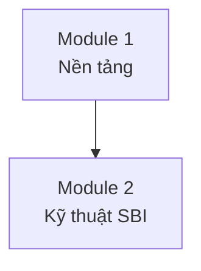

# Chuẩn đặt tên & liên kết tài liệu

File này là **nguồn chuẩn duy nhất** cho cách đặt tên folder, đặt tên file, và tạo link giữa các tài liệu trong bộ training Văn-Tư-Tu. Mọi ví dụ trong `SKILL.md` và `modular-architecture.md` phải tuân thủ file này.

## Nguyên tắc nền

1. **Tiếng Việt không dấu** cho mọi folder và file (trừ trường hợp ngoại lệ liệt kê bên dưới). Lý do: đồng nhất, tránh lỗi filesystem/zip/git/CI trên môi trường không hỗ trợ Unicode.
2. **kebab-case** (chữ thường, gạch ngang phân tách từ) cho mọi folder và file. Không dùng `snake_case`, `PascalCase`, khoảng trắng, hay camelCase.
3. **Zero-pad 2 chữ số** cho mọi tiền tố số (ví dụ `00-`, `01-`, `02-`) để đảm bảo thứ tự sắp xếp đúng khi có ≥10 mục.
4. **Prefix `_` cho folder meta/shared** — dùng cho tài nguyên không thuộc bất kỳ module nào (facilitator hub, đánh giá cấp khoá).
5. **Link là relative path markdown** — luôn dùng cú pháp `[nhan](duong-dan-tuong-doi)`, không dùng đường dẫn tuyệt đối, không để text trần.

## 1. Chuẩn đặt tên Folder

### 1.1. Quy tắc chung

| Đối tượng | Pattern | Ví dụ |
|-----------|---------|-------|
| Folder gốc khoá | `<slug-khoa>-training/` | `khoa-feedback-training/` |
| Folder module | `module-<NN>-<slug-chu-de>/` | `module-01-nen-tang-feedback/` |
| Folder phase (Văn/Tư/Tu/Đánh giá) | `<NN>-<slug-phase>/` | `01-van/`, `02-tu-suy-tu/`, `03-tu-thuc-hanh/`, `04-danh-gia/` |
| Folder meta/shared | `_<slug-noi-dung>/` | `_facilitator-hub/`, `_danh-gia-khoa/` |

### 1.2. Slug tạo như thế nào

1. Bỏ dấu tiếng Việt (`ặ → a`, `ề → e`, `ữ → u`, `đ → d`, `Đ → d`).
2. Chuyển về chữ thường toàn bộ.
3. Thay mọi ký tự không phải `[a-z0-9]` bằng `-`.
4. Gộp các `-` liên tiếp thành 1, cắt `-` ở đầu/cuối.
5. Giới hạn độ dài slug chủ đề ≤ 40 ký tự — dài hơn thì rút gọn giữ ý chính.

Ví dụ chuyển đổi:

| Gốc | Slug |
|-----|------|
| "Nền tảng Feedback" | `nen-tang-feedback` |
| "Kỹ thuật SBI — Situation/Behavior/Impact" | `ky-thuat-sbi` (rút gọn, bỏ phụ đề) |
| "Đào tạo Prompt Engineering cho Dev" | `prompt-engineering-cho-dev` |

### 1.3. Tên 4 phase bắt buộc

| Phase | Tên folder | Ghi chú |
|-------|-----------|---------|
| Văn | `01-van` | Tiếp nhận kiến thức |
| Tư (suy tư) | `02-tu-suy-tu` | Tiêu hoá, phản tư |
| Tu (thực hành) | `03-tu-thuc-hanh` | Thực hành, dự án |
| Đánh giá | `04-danh-gia` | Rubric, AAR |

Dù tỷ lệ Văn-Tư-Tu thay đổi theo module, **tên 4 phase không đổi**. Nếu module chọn chiều kiến tạo (Tu→Tư→Văn), vẫn dùng tên folder này — thứ tự học do README module quy định, không đổi tên folder.

## 2. Chuẩn đặt tên File

### 2.1. Quy tắc chung

- **Tất cả kebab-case, tiếng Việt không dấu.**
- Đuôi file `.md` cho tài liệu markdown.
- Không dùng ký tự đặc biệt, không dùng khoảng trắng, không dùng số thập phân.

### 2.2. File ngoại lệ (giữ uppercase tiếng Anh)

| File | Lý do giữ nguyên |
|------|------------------|
| `README.md` | Quy ước GitHub/GitLab — tự động render ở đầu folder |
| `LICENSE.md` (nếu có) | Quy ước chuẩn |

### 2.3. Tên file chuẩn theo vị trí

**Gốc khoá:**

| File | Vai trò |
|------|---------|
| `00-tong-quan.md` | Bản đồ toàn khoá (bắt buộc) |

**Trong mỗi module (`module-NN-<slug>/`):**

| File | Vai trò |
|------|---------|
| `README.md` | Thẻ căn cước module (bắt buộc) |

**Trong `01-van/`:**

| File | Vai trò |
|------|---------|
| `tai-lieu-chinh.md` | Kiến thức chính (≤10 trang) |
| `tom-tat.md` | Tóm tắt 1 trang |
| `kiem-tra-kien-thuc.md` | Quiz 5–10 câu |

**Trong `02-tu-suy-tu/`:**

| File | Vai trò |
|------|---------|
| `cau-hoi-phan-chieu.md` | 5–7 câu hỏi mở |
| `tinh-huong.md` | Case study + phân tích |
| `nhat-ky-phan-tu.md` | Template nhật ký |

**Trong `03-tu-thuc-hanh/`:**

| File | Vai trò |
|------|---------|
| `bai-thuc-hanh-co-huong-dan.md` | Guided practice |
| `du-an-thuc-te.md` | Brief dự án áp dụng |
| `checklist-hanh-dong.md` | Checklist hàng ngày |

**Trong `04-danh-gia/`:**

| File | Vai trò |
|------|---------|
| `rubric.md` | Tiêu chí đánh giá deliverable |
| `aar.md` | Template After-Action Review |

**Trong `_facilitator-hub/`:**

| File | Vai trò |
|------|---------|
| `huong-dan-chung.md` | Hướng dẫn facilitation |
| `so-do-module.md` | Prerequisite map |
| `lich-trinh-goi-y.md` | Gợi ý lịch trình |

**Trong `_danh-gia-khoa/`:**

| File | Vai trò |
|------|---------|
| `survey-cuoi-khoa.md` | Khảo sát cuối khoá |
| `follow-up-30-60-90.md` | Check-in sau 30/60/90 ngày |

### 2.4. Đặt tên file tuỳ chỉnh

Khi cần tạo file không có trong bảng trên, tuân thủ:

1. Kebab-case, VN không dấu.
2. Tên diễn đạt nội dung bằng 2–5 từ, không dùng chữ viết tắt tối nghĩa.
3. Nếu file có thứ tự (nhiều bài tập trong cùng phase), prefix `NN-`: `bai-01-quan-sat.md`, `bai-02-sbi.md`.

Ví dụ đúng: `template-phan-hoi-nhanh.md`, `vi-du-cuoc-hop-1-1.md`.
Ví dụ sai: `Template_Phan_Hoi.md` (snake + Pascal), `bài-1.md` (có dấu), `ex1.md` (viết tắt tối nghĩa), `bai tap 1.md` (có space).

## 3. Chuẩn Link giữa tài liệu

### 3.1. Cú pháp bắt buộc

**Luôn dùng markdown + relative path:**

```markdown
[Nhãn hiển thị](duong-dan-tuong-doi)
```

- **Nhãn**: viết tự nhiên, có dấu tiếng Việt được (ví dụ: `Module 2: Kỹ thuật SBI`).
- **Đường dẫn**: kebab-case, tính từ vị trí file chứa link, không bắt đầu bằng `/`.
- **Không** dùng URL tuyệt đối (`file:///Users/...`).
- **Không** để đường dẫn trần không bọc markdown.

### 3.2. Anchor (link tới heading trong cùng file hoặc file khác)

- Anchor luôn lowercase, thay space và ký tự không phải chữ số bằng `-`, bỏ dấu tiếng Việt.
- Ví dụ: heading `## Kỹ thuật SBI` → anchor `#ky-thuat-sbi`.

```markdown
Xem mục [Kỹ thuật SBI](../module-02-ky-thuat-sbi/README.md#ky-thuat-sbi).
```

### 3.3. Bản đồ link bắt buộc

Để đảm bảo điều hướng đầy đủ, các link sau **bắt buộc** phải có:

**Trong `00-tong-quan.md`:**

- Link tới mọi module: `[Module 1: Nền tảng](module-01-nen-tang/README.md)`
- Link tới facilitator hub: `[Facilitator Hub](_facilitator-hub/huong-dan-chung.md)`
- Link tới đánh giá khoá: `[Survey cuối khoá](_danh-gia-khoa/survey-cuoi-khoa.md)`

**Trong mỗi `module-NN-.../README.md`:**

- Link ngược về tổng quan: `[← Tổng quan khoá](../00-tong-quan.md)`
- Link tới từng phase của chính module: `[Văn](01-van/tai-lieu-chinh.md)`, `[Tư](02-tu-suy-tu/cau-hoi-phan-chieu.md)`, `[Tu](03-tu-thuc-hanh/bai-thuc-hanh-co-huong-dan.md)`, `[Đánh giá](04-danh-gia/rubric.md)`
- Link tới module prerequisite (nếu có): `[Prerequisite: Module 1](../module-01-nen-tang/README.md)`
- Link tới module tiếp theo: `[Module tiếp theo →](../module-03-nhan-feedback/README.md)`

**Trong file nội dung phase (`tai-lieu-chinh.md`, `cau-hoi-phan-chieu.md`, v.v.):**

- Đầu file: link về README module — `[← Module N: Tên](../README.md)`
- Cross-reference giữa phase trong cùng module nếu trích dẫn: `[Xem bài thực hành](../03-tu-thuc-hanh/bai-thuc-hanh-co-huong-dan.md)`

**Trong `_facilitator-hub/so-do-module.md`:**

- Mỗi node trong Mermaid prerequisite map phải có link thực tế tới module tương ứng (dùng `click` syntax của Mermaid):



### 3.4. Cấm

- Không link ra ngoài repo training (không nhúng URL Google Drive, Notion…) trong nội dung chuẩn. Nếu cần tham chiếu bên ngoài, đặt vào mục "Tài nguyên bổ sung" cuối file và ghi rõ.
- Không tạo link "placeholder" kiểu `TBD`, `#`, hay `./link-se-co-sau.md` — nếu chưa có file thật, không tạo link.
- Không dùng HTML `<a href>` — chỉ markdown.

## 4. Ví dụ cấu trúc chuẩn hoàn chỉnh

```
khoa-feedback-training/
├── 00-tong-quan.md
├── module-01-nen-tang-feedback/
│   ├── README.md
│   ├── 01-van/
│   │   ├── tai-lieu-chinh.md
│   │   ├── tom-tat.md
│   │   └── kiem-tra-kien-thuc.md
│   ├── 02-tu-suy-tu/
│   │   ├── cau-hoi-phan-chieu.md
│   │   ├── tinh-huong.md
│   │   └── nhat-ky-phan-tu.md
│   ├── 03-tu-thuc-hanh/
│   │   ├── bai-thuc-hanh-co-huong-dan.md
│   │   ├── du-an-thuc-te.md
│   │   └── checklist-hanh-dong.md
│   └── 04-danh-gia/
│       ├── rubric.md
│       └── aar.md
├── module-02-ky-thuat-sbi/
│   └── (cùng cấu trúc module-01)
├── _facilitator-hub/
│   ├── huong-dan-chung.md
│   ├── so-do-module.md
│   └── lich-trinh-goi-y.md
└── _danh-gia-khoa/
    ├── survey-cuoi-khoa.md
    └── follow-up-30-60-90.md
```

## 5. Checklist kiểm tra trước khi bàn giao

Trước khi coi bộ tài liệu là "xong", chạy qua checklist này:

- [ ] Mọi folder và file đều kebab-case, tiếng Việt không dấu (trừ `README.md`).
- [ ] Mọi tiền tố số đều zero-pad 2 chữ số (`01-`, không phải `1-`).
- [ ] Có đúng 4 phase folder trong mỗi module: `01-van`, `02-tu-suy-tu`, `03-tu-thuc-hanh`, `04-danh-gia`.
- [ ] Folder meta bắt đầu bằng `_` (`_facilitator-hub`, `_danh-gia-khoa`).
- [ ] `00-tong-quan.md` link tới TẤT CẢ module + facilitator hub + đánh giá khoá.
- [ ] Mỗi `README.md` module link: tổng quan, 4 phase, prerequisite (nếu có), module tiếp theo.
- [ ] Mỗi file nội dung phase có link ngược về `README.md` module ở đầu file.
- [ ] Prerequisite map trong `_facilitator-hub/so-do-module.md` có `click` link tới từng module.
- [ ] Không có link placeholder (`#`, `TBD`, file chưa tồn tại).
- [ ] Không có đường dẫn tuyệt đối, không có URL ngoài trong phần chính.
